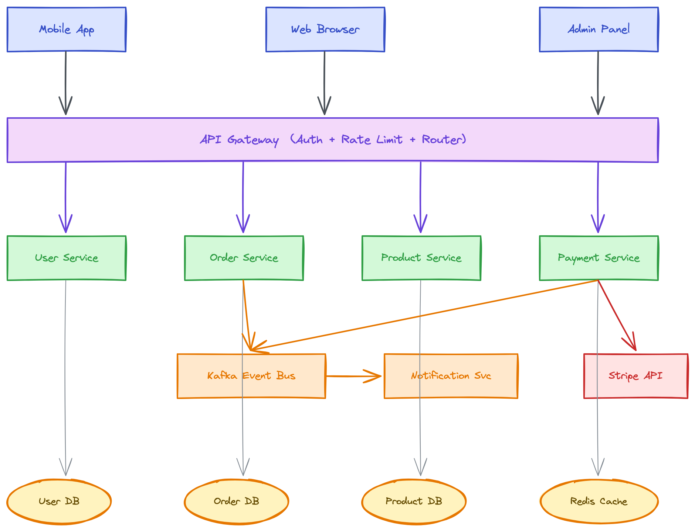

# Excalidraw 图表技能

自然语言生成手绘风格图表，自动导出为 PNG/SVG 的 Claude Code 技能。

[English](README_EN.md)

## 为什么选这个 skill

- **自然语言生成图表** — 用中文或英文描述你想要的内容，自动生成专业图表，无需手动拖拽布局。
- **零学习成本** — 不需要学习 Excalidraw JSON 格式、Mermaid 语法或任何 DSL，直接说就行。
- **零安装即可使用** — Kroki API 方案只需要 `curl`，无需 npm、Docker 或浏览器自动化工具。
- **主动生成** — 当 Claude 检测到复杂系统需要可视化解释时，自动触发画图，不需要你明确要求。
- **专业设计体系** — 内置语义色彩系统（60-30-10 法则）、字体大小层次、箭头语义（实线/虚线/点线），以及针对不同图表类型的布局模式。
- **5 种图表模式** — 流程图、架构图、时序图、思维导图、泳道图，各有专门的布局规则和间距规范。
- **反模式防护** — 文档化常见陷阱（区域文字重叠、箭头面条化、标签碰撞），让 Claude 在生成前就规避问题。
- **智能尺寸计算** — 根据标签文字自动计算元素宽度（`max(160, charCount * 9)`），CJK 字符自适应，杜绝文字截断。
- **精确间距体系** — 有标签/无标签箭头的像素级间距规则，列间距、行间距、区域内边距一目了然。
- **3 种箭头路由** — 直线、L 形折线、曲线弯折三种路由模式，连线清晰不混乱。
- **可编辑输出** — `.excalidraw` 文件可在 [excalidraw.com](https://excalidraw.com) 中打开编辑，箭头交互绑定完整保留。
- **支持离线** — 本地 CLI 方案（基于 Firefox）完全在本机运行，无需网络。

## 与同类 skill 对比

| 能力 | **本技能** | 原生 Claude Code | 其他技能 |
|------|:-:|:-:|:-:|
| 生成 Excalidraw JSON | ✓ 有设计体系引导 | ✓ 能写但无布局规范 | ✓ 各有侧重 |
| 导出 PNG/SVG | ✓ 自动完成 | ✗ 需手动要求 | 部分支持 |
| 零安装导出（Kroki API） | ✓ 仅需 curl | ✗ 无备选方案 | 不支持 |
| 主动触发（自动检测） | ✓ 3+组件自动触发 | ✗ 仅在明确要求时 | 不支持 |
| 语义色彩系统 | ✓ 60-30-10 法则 | ✗ 无设计规范 | 部分支持 |
| 精确间距规则 | ✓ 像素级规范 | ✗ 凭感觉布局 | 部分支持 |
| 反模式防护 | ✓ 内置陷阱文档 | ✗ 无防护 | 不支持 |
| 智能尺寸计算（中文感知） | ✓ 自动适配 | ✗ 容易截断 | 不支持 |
| 箭头路由（直线/折线/曲线） | ✓ 3 种模式 | ✗ 仅直线 | 部分支持 |
| 双向箭头绑定 | ✓ 完整交互 | ✗ 静态连线 | 部分支持 |
| 中英双语 | ✓ 关键词触发 | ✗ 无关键词触发 | 不支持 |
| 端到端工作流 | ✓ 生成→导出→报告 | ✗ 仅生成代码 | 部分支持 |
| 单文件自包含 | ✓ 一个 SKILL.md | 不适用 | 否（4-6 个文件） |

**相比原生 Claude Code 的核心优势：**
- **完整管道** — Claude Code 能写 Excalidraw JSON，但不会自动导出图片、不懂设计规范。本技能提供从生成到交付的完整自动化
- **专业品质** — 内置语义色彩、精确间距、箭头路由等设计体系，输出即可用，无需手动调整
- **防错机制** — 反模式防护避免文字重叠、箭头混乱等常见问题
- **主动画图** — 讨论架构时自动触发，不需要你专门要求

## 为什么用 Skill 而不是 MCP？

Excalidraw 的 JSON 格式就是一个元素数组，每个元素有 x/y/width/height —— Claude 天然就能写。Skill 教 Claude「怎么画」，MCP 给 Claude「一个画笔」。当 LLM 自己就能画的时候，教它怎么画更好。

| 维度 | Skill | MCP Server |
|------|-------|------------|
| 原理 | 提示词注入到 Claude 上下文 | 独立运行的服务进程 |
| 生成方式 | Claude 直接写 JSON（LLM 原生能力） | 需要代码处理 JSON 生成逻辑 |
| 灵活性 | Claude 理解语义，自由布局 | API 参数固定，灵活性受限 |
| 安装 | 复制一个文件 | 启动服务、配置 MCP |
| 依赖 | 零 | Node.js / Python 运行时 |
| 导出 | 调用现有工具（curl / CLI） | 需内置导出逻辑或仍然调 curl |

MCP 的价值在于提供 Claude **自身做不到的能力** —— 数据库访问、浏览器自动化、带认证的 API。图表生成的核心是 **设计布局 + 写 JSON**，恰恰是 LLM 最擅长的。

## 功能说明

- 根据自然语言描述生成 `.excalidraw` JSON 文件
- 通过 **Kroki** API 导出为 SVG — 零安装，仅需 `curl`
- 使用 `excalidraw-brute-export-cli` 本地导出为 PNG/SVG（基于 Firefox）
- 当图表有助于解释复杂系统时自动触发
- 自动应用语义色彩、字体层次和箭头样式
- 根据标签文字自动计算元素宽度，CJK 字符自适应
- 大型图表分段构建，避免 token 超限
- 生成完全可交互的文件，支持双向箭头绑定

## 特性

### 语义色彩系统

8 种语义色彩类别 — 主要（蓝）、成功（绿）、警告（黄）、错误（红）、外部（紫）、流程（天蓝）、触发（橙）、中性（灰蓝）。遵循 60-30-10 法则：60% 留白、30% 主色调、10% 强调色。

### 图表模式

| 模式 | 布局 | 适用场景 |
|------|------|----------|
| 流程图 | 左右或上下，200px 间距 | 流程、决策树 |
| 架构图 | 列式布局，精确间距规则 | 系统设计、微服务 |
| 时序图 | 参与者间 200px | API 流程、协议 |
| 思维导图 | 放射状，逐级缩小 | 头脑风暴、概念图 |
| 泳道图 | 水平泳道 + 跨道箭头 | 跨团队工作流 |

### 精确间距体系

| 场景 | 间距 |
|------|------|
| 有标签箭头间距 | 150–200px |
| 无标签箭头间距 | 100–120px |
| 列间距（有标签） | 400px |
| 列间距（无标签） | 340px |
| 区域内边距 | 50–60px |

### 箭头路由

3 种模式：直线（默认）、L 形折线（`points` 直角转折）、曲线弯折（`roundness: { type: 2 }`）。

### 箭头语义

| 样式 | 含义 |
|------|------|
| 实线 | 主流程 |
| 虚线 | 响应、异步 |
| 点线 | 可选、弱依赖 |

### 智能元素尺寸

根据标签文字自动计算宽度：西文字符 `max(160, charCount * 9)`，中日韩字符 `max(160, charCount * 18)`。避免生成图表中的文字截断问题。

### 字体层次

标题（28px）→ 组标题（24px）→ 标签（20px）→ 描述（16px）→ 注释（14px）

### 反模式防护

内置常见陷阱文档 — 区域文字居中重叠、跨区域箭头面条化、短箭头标签碰撞、容器透明度规则 — 让 Claude 在生成前就规避错误。

## 依赖项

| 工具 | 用途 |
|------|------|
| `curl` | 将 `.excalidraw` 发送到 Kroki API 渲染为 SVG |
| `excalidraw-brute-export-cli` | 本地导出 `.excalidraw` → PNG/SVG 的命令行工具 |
| `Playwright + Firefox` | 本地 CLI 使用的无头浏览器 |

`curl` 在 macOS、Linux、Windows（Git Bash/WSL）上已预装。

## 安装技能

**Claude Code（全局）：**
```bash
git clone https://github.com/Agents365-ai/excalidraw-skill.git ~/.claude/skills/excalidraw
```

**Claude Code（仅当前项目）：**
```bash
git clone https://github.com/Agents365-ai/excalidraw-skill.git .claude/skills/excalidraw
```

**OpenClaw：**
```bash
git clone https://github.com/Agents365-ai/excalidraw-skill.git skills/excalidraw
```

**SkillsMP：** 在 [skillsmp.com](https://skillsmp.com) 搜索 `excalidraw`，一键安装。

## 安装依赖

### 方式 A：Kroki API（推荐 — 零安装，仅 SVG）

```bash
# curl 已预装，验证即可：
curl --version
```

无需额外配置，SVG 通过 `https://kroki.io` 渲染。

### 方式 B：本地 CLI（PNG 必须使用此方式）

```bash
npm install -g excalidraw-brute-export-cli
npx playwright install firefox
```

### 平台说明

| 平台 | 额外步骤 |
|------|----------|
| **macOS** | 需要打一次补丁（见下方） |
| **Windows** | 无需额外操作 |
| **Linux** | 无需额外操作 |

### macOS 补丁（一次性，本地 CLI 必须）

CLI 使用 `Control+O` / `Control+Shift+E`，但 macOS 需要 `Meta`（Cmd）键：

```bash
CLI_MAIN=$(npm root -g)/excalidraw-brute-export-cli/src/main.js
sed -i '' 's/keyboard.press("Control+O")/keyboard.press("Meta+O")/' "$CLI_MAIN"
sed -i '' 's/keyboard.press("Control+Shift+E")/keyboard.press("Meta+Shift+E")/' "$CLI_MAIN"
```

## 使用方式

直接描述你想要的图表：

```
画一个微服务电商架构图，包含 Mobile/Web/Admin 客户端，API Gateway，
Auth/User/Order/Product/Payment 微服务，Kafka 消息队列，Notification 服务，
以及各自独立的数据库
```

Claude 会自动生成 `.excalidraw` 文件并导出为 PNG。

## 示例

**提示词：**
> 画一个微服务电商架构图，包含 Mobile/Web/Admin 客户端，API Gateway（含认证+限流+路由），
> Auth/User/Order/Product/Payment 微服务，Kafka 消息队列，Notification 服务，
> User DB / Order DB / Product DB / Redis Cache / Stripe API

**输出效果：**



## 文件说明

- `SKILL.md` — Claude Code 加载的技能指令文件
- `README.md` — 本文件（中文）
- `README_EN.md` — 英文说明
- `assets/` — 示例图表

## 开源协议

MIT

## 支持作者

如果这个 skill 对你有帮助，欢迎支持作者：

<table>
  <tr>
    <td align="center">
      
      <br>
      <b>微信支付</b>
    </td>
    <td align="center">
      
      <br>
      <b>支付宝</b>
    </td>
    <td align="center">
      
      <br>
      <b>Buy Me a Coffee</b>
    </td>
  </tr>
</table>

## 作者

**Agents365-ai**

- Bilibili: https://space.bilibili.com/441831884
- GitHub: https://github.com/Agents365-ai
