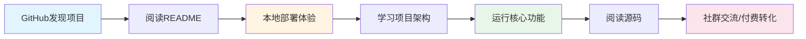
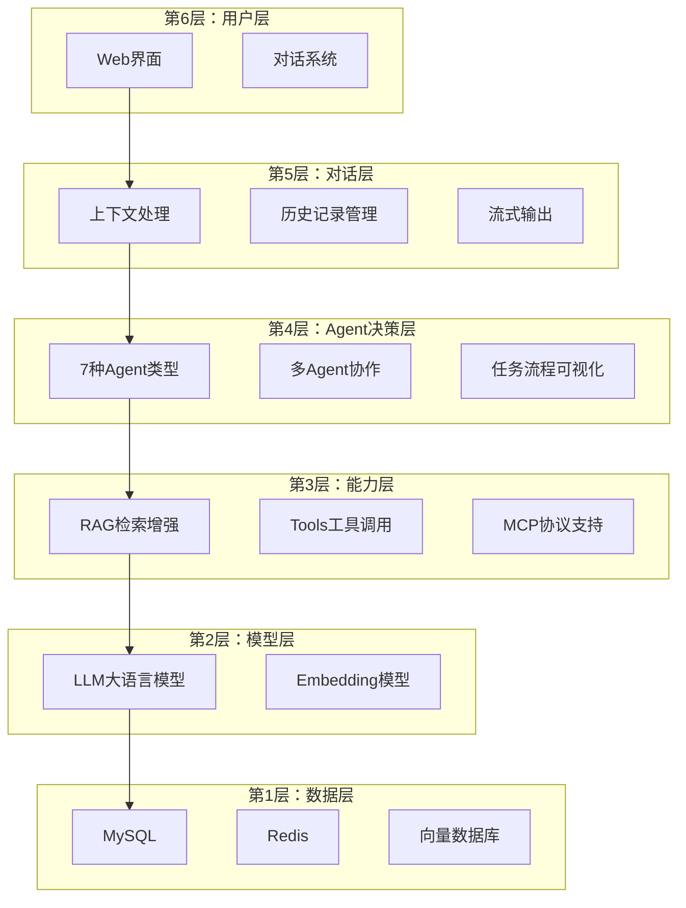

# PRD：OmniAgent AI Agent 开发教学平台 MVP版本

> **版本**: v1.0
> **创建日期**: 2026-05-14
> **产品类型**: 教学项目 / AI Agent 平台
> **技术栈**: FastAPI + Vue 3 + LangChain
> **当前版本**: v2.4.0

---

## 1. 产品定位

为**AI工程学习者**提供**完整可实战的AI Agent开发教学项目**的教学平台

### 核心差异化

| 维度 | OmniAgent | 竞品对比 |
|------|-----------|----------|
| **完整性** | ✅ 完整可运行的系统（非Demo） | ❌ 大多是简化的Demo代码 |
| **工程质量** | ✅ 工程级代码，分层架构设计 | ⚠️ 代码质量参差不齐 |
| **教学性** | ✅ 详细文档+代码注释+学习路径 | ❌ 文档不完善，学习曲线陡 |
| **覆盖面** | ✅ 前端+后端+数据库+部署全栈 | ⚠️ 通常只覆盖部分技术栈 |

### 价值主张

> **一个集成了大模型能力、Agent机制、知识检索、工具调用和前后端系统的完整AI工程模板**

---

## 2. 用户故事（核心场景）

### 场景1：求职转行者学习Agent开发

**作为** 有Python基础的求职转行者
**我想要** 通过完整项目学习AI Agent开发
**以便于** 提升竞争力，进入AI/大模型相关岗位

**用户痛点**：
- 理论零散：通过碎片化教程学习，缺乏系统性
- 缺乏实战：只有理论课程和简单Demo
- 架构盲区：不知道如何设计完整AI系统

### 场景2：后端工程师技能升级

**作为** 从传统开发转向AI方向的后端工程师
**我想要** 学习Agent与RAG等AI技术
**以便于** 补齐AI工程能力，适应技术转型

**用户痛点**：
- 工程经验不足：缺乏前端后端联调、流式输出等实践
- 技术栈混乱：AI技术更新快，不知道该学哪些

### 场景3：独立开发者构建产品

**作为** 希望基于AI构建产品的独立开发者
**我想要** 获得完整的技术模板和架构参考
**以便于** 快速开发自己的AI应用

**用户痛点**：
- 缺乏参考：没有完整的架构设计参考
- 重复造轮：缺少可复用的技术模板

### 场景4：AI产品经理理解技术边界

**作为** AI产品经理
**我想要** 了解AI系统能力如何转化为功能
**以便于** 更好地进行产品设计和团队协作

**用户痛点**：
- 技术理解不足：不清楚AI能力边界
- 沟通成本高：与技术开发沟通困难

---

## 3. 功能清单

### P0功能（MVP必须有 - ✅已实现）

#### Agent系统

| 功能 | 描述 | 实现状态 |
|------|------|----------|
| **General Agent** | 通用对话能力，基础交互 | ✅ 已实现 |
| **React Agent** | 推理-行动循环，支持工具调用 | ✅ 已实现 |
| **Plan-Execute Agent** | 任务规划与执行，复杂任务拆解 | ✅ 已实现 |
| **MCP Agent** | MCP协议支持，扩展能力 | ✅ 已实现 |
| **Skill Agent** | 渐进式Prompt加载，业务逻辑增强 | ✅ 已实现 |
| **Text2SQL Agent** | 自然语言转SQL查询 | ✅ 已实现 |
| **CodeAct Agent** | 代码解释与执行 | ✅ 已实现 |
| **多Agent协作** | 任务自动分解，跨Agent分工 | ✅ 已实现 |
| **任务流程可视化** | 实时展示推理决策路径 | ✅ 已实现 |
| **流式输出** | SSE实时推送，类似ChatGPT体验 | ✅ 已实现 |

#### RAG知识库系统

| 功能 | 描述 | 实现状态 |
|------|------|----------|
| **多格式文档解析** | PDF/Docx/Markdown/Txt支持 | ✅ 已实现 |
| **智能分块** | 基于物理布局感知的语义分块 | ✅ 已实现 |
| **向量检索** | Embedding相似度检索 | ✅ 已实现 |
| **关键词检索** | Elasticsearch/BM25精确匹配 | ✅ 已实现 |
| **混合检索** | 向量+关键词综合检索 | ✅ 已实现 |
| **Rerank重排序** | 提升结果相关性 | ✅ 已实现 |
| **知识库管理界面** | 文档上传、解析、向量化可视化 | ✅ 已实现 |

#### 工具与扩展

| 功能 | 描述 | 实现状态 |
|------|------|----------|
| **内置工具集** | 搜索、计算、时间等常用工具 | ✅ 已实现 |
| **自定义工具上传** | 通过OpenAPI/Swagger上传 | ✅ 已实现 |
| **MCP服务器集成** | 动态挂载自定义MCP服务 | ✅ 已实现 |
| **Skill机制** | Prompt渐进式加载 | ✅ 已实现 |

#### 基础功能

| 功能 | 描述 | 实现状态 |
|------|------|----------|
| **用户认证** | 注册、登录、权限管理 | ✅ 已实现 |
| **对话历史** | 完整的历史记录管理 | ✅ 已实现 |
| **会话管理** | 多会话切换与管理 | ✅ 已实现 |
| **配置管理** | YAML配置，灵活调整 | ✅ 已实现 |

### P1功能（产品化增强 - 🚧开发中）

#### 教学模块

| 功能 | 描述 | 优先级 |
|------|------|--------|
| **项目架构图解** | 6层架构可视化图解 | 高 |
| **核心流程可视化** | 对话/RAG/工具调用流程图 | 高 |
| **代码注释增强** | 核心模块注释覆盖率>30% | 中 |
| **学习路径指引** | 初学者/进阶两套学习路径 | 中 |

#### 用户体验优化

| 功能 | 描述 | 优先级 |
|------|------|--------|
| **首页产品介绍** | 核心价值、快速开始、功能展示 | 高 |
| **快速开始指引** | 5分钟部署体验指引 | 高 |
| **常见问题FAQ** | 部署、使用、开发FAQ | 中 |
| **反馈与建议入口** | GitHub Issues、社群链接 | 低 |

#### 运营功能

| 功能 | 描述 | 优先级 |
|------|------|--------|
| **数据埋点** | 用户行为分析（GA/百度统计） | 中 |
| **社群引流入口** | 微信群、公众号、B站 | 中 |

### P2功能（未来考虑 - 📋规划中）

- [ ] 视频教程集成
- [ ] 付费课程模块
- [ ] 在线代码沙箱
- [ ] 社区论坛
- [ ] 技术咨询预约

---

## 4. 核心流程图

### 用户核心流程



### 对话流程（已实现）

```
用户输入 → 选择Agent类型 → 配置参数 → 流式输出 → 查看推理路径 → 历史记录管理
```

### RAG使用流程（已实现）

```
上传文档 → 自动解析 → 智能分块 → 向量化 →
提问检索 → 混合检索 → Rerank重排 → 生成回答
```

### 技术架构流程



---

## 5. 页面结构

### 已实现页面

| 页面 | 路径 | 功能描述 | 对应文件 |
|------|------|----------|----------|
| **聊天页面** | /chat | Agent对话主界面 | `pages/Chat.vue` |
| **Agent管理** | /agent | Agent配置与管理 | `pages/AgentManage.vue` |
| **知识库管理** | /knowledge | RAG知识库操作 | `pages/Knowledge.vue` |
| **数据看板** | /dashboard | 系统数据展示 | `pages/Dashboard.vue` |

### 需要新增/优化的页面

| 页面 | 优先级 | 功能描述 |
|------|--------|----------|
| **首页** | 高 | 产品介绍、快速开始、核心功能展示 |
| **文档中心** | 高 | 架构说明、API文档、学习路径 |
| **部署指南** | 高 | 安装步骤、环境配置、常见问题 |
| **关于页面** | 中 | 项目背景、联系方式、商业合作 |

### 页面信息架构

```
首页 (/)
├── 核心价值展示
├── 快速开始指引
├── 功能亮点
└── 联系方式

对话系统 (/chat)
├── Agent选择器
├── 对话历史
├── 实时流式输出
└── 推理路径可视化

Agent管理 (/agent)
├── Agent配置
├── 工具管理
├── MCP服务器配置
└── 技能管理

知识库 (/knowledge)
├── 文档上传
├── 解析状态
├── 检索测试
└── 知识库管理

文档中心 (/docs)
├── 快速开始
├── 架构设计
├── API文档
├── 部署指南
└── 常见问题

关于 (/about)
├── 项目背景
├── 技术栈
├── 开源协议
└── 联系方式
```

---

## 6. 数据埋点计划

### 核心指标追踪

| 事件名称 | 触发时机 | 关键参数 | 业务目标 |
|---------|---------|---------|----------|
| **page_view** | 页面访问 | page_name, referrer | 了解用户访问路径 |
| **agent_type_select** | 选择Agent类型 | agent_type | 分析各Agent使用情况 |
| **chat_message_send** | 发送对话消息 | agent_type, message_length | 了解用户使用频率 |
| **rag_file_upload** | 上传知识库文件 | file_type, file_size | 了解RAG使用情况 |
| **tool_execute** | 工具调用 | tool_name, success | 分析工具使用情况 |
| **github_link_click** | 点击GitHub链接 | source | 了解流量来源 |
| **community_join_click** | 点击社群入口 | community_type | 转化漏斗分析 |
| **doc_view** | 文档页面访问 | doc_name, scroll_depth | 了解学习深度 |

### 技术实现方案

**前端埋点**：
- 使用 Google Analytics 4 或 百度统计
- 页面访问自动追踪
- 自定义事件手动上报

**后端埋点**（可选）：
- 自建埋点API
- MySQL存储原始数据
- 定期聚合分析

**隐私保护**：
- 遵循数据保护法规
- 提供隐私政策说明
- 用户可选择性退出

---

## 7. 非功能需求

### 性能要求

| 指标 | 目标值 | 测量方法 | 优先级 |
|------|--------|----------|--------|
| **首屏加载时间** | < 3秒 | LCP (Largest Contentful Paint) | P0 |
| **API响应时间** | < 500ms | P95延迟 | P0 |
| **流式输出延迟** | < 100ms | 首字返回时间 | P0 |
| **并发支持** | 100+ | 同时在线用户数 | P1 |

### 兼容性

**浏览器支持**：
- Chrome 90+
- Safari 14+
- Firefox 88+
- Edge 90+

**移动端**：
- 响应式设计
- 支持主流移动浏览器

**服务端环境**：
- Python 3.12+
- Node.js 18+
- MySQL 8.0+
- Redis 6.0+

### 安全性

| 安全措施 | 描述 | 优先级 |
|---------|------|--------|
| **HTTPS** | 加密传输 | P0 |
| **API Key保护** | 环境变量存储，不提交代码 | P0 |
| **数据加密** | 敏感数据加密存储 | P0 |
| **请求限流** | 防止API滥用 | P1 |
| **SQL注入防护** | 参数化查询 | P0 |
| **XSS防护** | 输入输出编码 | P0 |

### 可维护性

| 指标 | 目标值 | 说明 |
|------|--------|------|
| **代码注释覆盖率** | >30% | 核心模块 |
| **API文档** | 完整 | Swagger/OpenAPI |
| **错误日志** | 完整 | 结构化日志 |
| **配置清晰** | 可配置 | YAML配置文件 |

### 可部署性

- Docker 容器化部署
- 一键启动脚本
- 详细的部署文档
- 常见问题FAQ

---

## 8. 开发与上线计划

### MVP开发时间预估

基于项目分析，核心功能已完成，剩余工作：

| 阶段 | 内容 | 预估时间 | 依赖 |
|------|------|----------|------|
| **文档完善** | README、API文档、部署指南 | 3-5天 | - |
| **首页开发** | 产品介绍页面 | 2-3天 | 设计稿 |
| **教学模块** | 架构图、流程图、学习路径 | 3-5天 | - |
| **埋点接入** | 数据统计与分析 | 2天 | - |
| **测试优化** | 功能测试、性能优化 | 2-3天 | - |
| **合计** | | **2-3周** | |

### 上线时间目标

| 里程碑 | 日期 | 关键产出 |
|--------|------|----------|
| **MVP上线** | 2026-06-01 | 完整功能+文档 |
| **推广启动** | 2026-06-01 | GitHub发布、B站视频 |
| **数据复盘** | 2026-07-01 | 上线1个月数据分析 |

---

## 9. 成功指标（上线1个月）

### 核心指标

| 指标 | 目标值 | 测量方式 |
|------|--------|----------|
| **GitHub Stars** | 500+ | GitHub API |
| **课程购买人数** | 50人 | 销售数据 |
| **项目部署成功数** | 100+ | Issue/PR反馈 |

### 次要指标

| 指标 | 目标值 | 测量方式 |
|------|--------|----------|
| **B站视频播放量** | 5000+ | B站后台 |
| **开发者交流群人数** | 200人 | 社群统计 |
| **Issue/PR数量** | 30+ | GitHub API |

### 访问指标

| 指标 | 目标值 | 测量方式 |
|------|--------|----------|
| **在线Demo访问量** | 1000+ | 埋点数据 |
| **README浏览量** | 2000+ | GitHub Traffic |
| **文档页访问量** | 1500+ | 埋点数据 |

---

## 10. 风险与应对

### 技术风险

| 风险项 | 影响 | 应对策略 |
|--------|------|----------|
| **多模型接入兼容性** | 中 | 优先支持主流模型（通义千问、DeepSeek），提供清晰配置文档 |
| **依赖版本冲突** | 低 | 使用Poetry管理依赖，提供完整的依赖锁定文件 |
| **前端环境差异** | 低 | 提供Docker部署方案，降低环境配置门槛 |

### 市场风险

| 风险项 | 影响 | 应对策略 |
|--------|------|----------|
| **同类教学项目竞争** | 中 | 强调工程完整性和教学属性，建立差异化 |
| **AI技术更新快** | 中 | 保持项目更新，及时跟进新技术 |
| **用户需求变化** | 低 | 社区驱动，根据反馈调整功能优先级 |

### 时间风险

| 风险项 | 影响 | 应对策略 |
|--------|------|----------|
| **文档编写耗时** | 中 | 分阶段发布，先完成核心功能文档 |
| **视频制作周期长** | 中 | 边开发边录制，快速迭代 |

---

## 11. 附录：技术栈概览

### 后端技术栈

| 技术 | 版本 | 用途 |
|------|------|------|
| **FastAPI** | 0.121.0 | 高性能异步Web框架 |
| **LangChain** | 1.0.3 | AI Agent编排框架 |
| **SQLModel** | 0.0.27 | ORM数据库操作 |
| **Redis** | 7.0.1 | 缓存与会话存储 |
| **MySQL** | 8.0+ | 关系型数据库 |

### 前端技术栈

| 技术 | 版本 | 用途 |
|------|------|------|
| **Vue 3** | 3.4+ | 渐进式JavaScript框架 |
| **TypeScript** | - | 类型安全 |
| **Element Plus** | - | UI组件库 |
| **Pinia** | - | 状态管理 |
| **Vite** | - | 构建工具 |

### AI/ML框架

| 框架 | 用途 |
|------|------|
| **LangChain** | Agent编排与流程控制 |
| **DashScope** | 阿里通义千问模型 |
| **Anthropic** | Claude模型支持 |
| **Tavily-Python** | 网络搜索能力 |

---

**决策结果**：☑ 继续执行  ☐ 放弃  ☐ 待定

**下一步行动**：
1. ✅ 完成PRD文档编写
2. ⏳ 开始首页原型设计
3. ⏳ 完善项目文档（README、部署指南）
4. ⏳ 接入数据埋点
5. ⏳ 准备GitHub发布与推广

---

**文档作者**: dtsola
**最后更新**: 2026-05-14
**联系方式**: 微信 dtsola（技术交流 | 商务合作）
