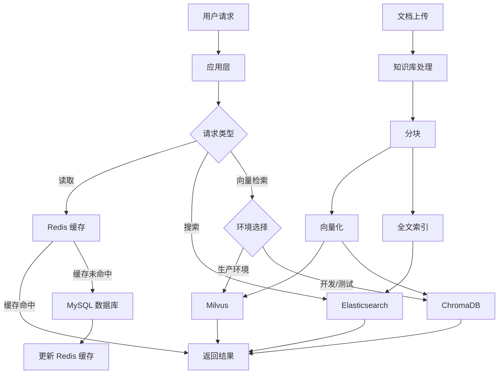

# OmniAgent - NoSQL 数据库设计文档

---

## 文档信息

| 项目 | 内容 |
|------|------|
| **项目名称** | OmniAgent AI Agent 开发教学平台 |
| **文档版本** | v1.1 |
| **创建日期** | 2026-05-14 |
| **最后更新** | 2026-05-14 |

---

## 目录

1. [概述](#1-概述)
2. [Redis 缓存设计](#2-redis-缓存设计)
3. [Milvus 向量数据库设计](#3-milvus-向量数据库设计)
4. [ChromaDB 本地向量数据库设计](#4-chromadb-本地向量数据库设计)
5. [Elasticsearch 全文检索设计](#5-elasticsearch-全文检索设计)
6. [数据流转关系](#6-数据流转关系)

---

## 1. 概述

OmniAgent 平台采用**多数据库架构**，根据不同的应用场景选择合适的 NoSQL 数据库：

| 数据库 | 版本 | 部署模式 | 用途 | 应用场景 |
|--------|------|----------|------|----------|
| **Redis** | 7.0.1 | Standalone | 缓存、会话管理 | Token 缓存、会话状态、限流、分布式锁 |
| **Milvus** | 2.6.3 | Standalone/Lite | 分布式向量数据库 | 生产环境 RAG 检索、大规模向量搜索 |
| **ChromaDB** | Latest | 嵌入式 | 本地向量数据库 | 开发/测试环境、轻量级 RAG、本地记忆存储 |
| **Elasticsearch** | 9.2.0 | Standalone | 全文检索 | 文档全文搜索、日志检索、知识库检索 |

**向量数据库选型策略：**
- **开发/测试环境**：使用 ChromaDB（轻量、无需额外部署）
- **生产环境**：使用 Milvus（高性能、可扩展）
- **本地演示**：使用 Milvus Lite（单机版 Milvus）

### 1.1 架构设计原则

- **职责分离**：每个数据库负责特定的功能领域
- **性能优化**：根据数据特点选择最优的存储方案
- **可扩展性**：支持水平扩展和负载均衡
- **数据一致性**：通过事件驱动保证多数据库间的数据同步

---

## 2. Redis 缓存设计

### 2.1 Redis 概述

Redis 是一个高性能的键值存储系统，用于：
- **缓存热点数据**：减少数据库压力
- **会话管理**：存储用户会话状态
- **分布式锁**：保证并发安全
- **限流控制**：防止 API 滥用

### 2.2 连接配置

**配置示例：**

```python
# settings.py
REDIS = {
    'endpoint': 'redis://localhost:6379/0',
    'max_connections': 10,
    'socket_timeout': 5,
    'socket_connect_timeout': 5
}
```

**连接池管理：**

```python
from redis import ConnectionPool
from redis import Redis

class RedisClient:
    def __init__(self, url, max_connections=10):
        self.pool = ConnectionPool.from_url(
            url,
            max_connections=max_connections
        )
        self.connection = redis.StrictRedis(
            connection_pool=self.pool
        )
```

### 2.3 数据结构设计

#### 2.3.1 Token 缓存

| 键格式 | 数据类型 | 过期时间 | 说明 |
|--------|----------|----------|------|
| `token:{user_id}` | String | 7天 | 用户 Token 缓存 |
| `token:refresh:{user_id}` | String | 30天 | 刷新 Token 缓存 |

**数据结构：**

```
token:user_123
{
  "access_token": "eyJhbGciOiJIUzI1NiIs...",
  "expires_at": 1715721600,
  "user_info": {
    "user_id": "user_123",
    "user_name": "dtsola",
    "roles": ["admin"]
  }
}
```

#### 2.3.2 会话管理

| 键格式 | 数据类型 | 过期时间 | 说明 |
|--------|----------|----------|------|
| `session:{dialog_id}` | Hash | 24小时 | 对话会话状态 |
| `session:workspace:{session_id}` | Hash | 7天 | 工作台会话状态 |

**数据结构：**

```
HSET session:dialog_456
  "agent_id" "agent_789"
  "user_id" "user_123"
  "message_count" "15"
  "last_activity" "1715721600"
  "context" "{\"summary\": \"讨论 Python 编程\"}"
```

#### 2.3.3 限流控制

| 键格式 | 数据类型 | 过期时间 | 说明 |
|--------|----------|----------|------|
| `ratelimit:{user_id}:{api}` | String | 60秒 | API 限流 |
| `ratelimit:global:{api}` | String | 60秒 | 全局限流 |

**限流算法（令牌桶）：**

```python
# 每分钟最多 60 次请求
key = f"ratelimit:{user_id}:chat"
current = redis_client.incr(key, expiration=60)

if current > 60:
    raise RateLimitException("请求过于频繁")
```

#### 2.3.4 分布式锁

| 键格式 | 数据类型 | 过期时间 | 说明 |
|--------|----------|----------|------|
| `lock:{resource}:{id}` | String | 30秒 | 资源锁 |

**加锁/解锁：**

```python
# 加锁（SETNX）
lock_key = f"lock:agent:{agent_id}"
locked = redis_client.setNx(lock_key, "locked", expiration=30)

if not locked:
    raise LockException("Agent 正在被使用")

# 解锁
redis_client.delete(lock_key)
```

#### 2.3.5 热点数据缓存

| 键格式 | 数据类型 | 过期时间 | 说明 |
|--------|----------|----------|------|
| `cache:agent:{agent_id}` | String | 1小时 | Agent 配置缓存 |
| `cache:knowledge:{knowledge_id}` | String | 1小时 | 知识库元数据缓存 |
| `cache:user:{user_id}` | String | 30分钟 | 用户信息缓存 |

### 2.4 常用操作

**设置缓存：**

```python
redis_client.set(
    key="cache:agent:agent_123",
    value=agent_config,
    expiration=3600
)
```

**获取缓存：**

```python
agent_config = redis_client.get("cache:agent:agent_123")
```

**Hash 操作：**

```python
# 设置 Hash 字段
redis_client.hset(
    name="session:dialog_456",
    key="agent_id",
    value="agent_789",
    expiration=86400
)

# 获取 Hash 所有字段
session_data = redis_client.hgetall("session:dialog_456")
```

**删除缓存：**

```python
redis_client.delete("cache:agent:agent_123")
```

### 2.5 性能优化建议

1. **连接池管理**
   - 使用连接池避免频繁创建/销毁连接
   - 设置合理的 `max_connections`

2. **键命名规范**
   - 使用冒号分隔命名空间
   - 示例：`cache:agent:{id}`

3. **过期时间策略**
   - Token：7天
   - 会话：24小时-7天
   - 热点数据：30分钟-1小时

4. **内存优化**
   - 使用 Hash 结构存储对象
   - 及时清理过期数据

---

## 3. Milvus 向量数据库设计

### 3.1 Milvus 概述

Milvus 是一个开源的向量数据库，用于：
- **RAG 检索**：文档语义检索
- **记忆存储**：Agent 长期记忆管理
- **语义搜索**：基于向量相似度的搜索

### 3.2 连接配置

**配置示例：**

```python
# settings.py
VECTOR_DB = {
    'type': 'milvus',
    'host': 'localhost',
    'port': 19530,
    'index_type': 'IVF_FLAT',
    'metric_type': 'L2',
    'embedding_dim': 1024
}
```

**客户端初始化：**

```python
from pymilvus import connections

connections.connect(
    alias="default",
    host="localhost",
    port="19530"
)
```

### 3.3 Collection 设计

#### 3.3.1 RAG 检索 Collection

**Collection 名称：** `knowledge_{knowledge_id}`

**字段设计：**

| 字段名 | 类型 | 说明 |
|--------|------|------|
| id | INT64 | 主键（自增） |
| chunk_id | VARCHAR(256) | 文本块 ID |
| content | VARCHAR(2048) | 文本内容 |
| embedding | FLOAT_VECTOR(1024) | 内容向量 |
| summary | VARCHAR(1024) | 文本摘要 |
| embedding_summary | FLOAT_VECTOR(1024) | 摘要向量 |
| file_id | VARCHAR(128) | 文件 ID |
| file_name | VARCHAR(256) | 文件名 |
| knowledge_id | VARCHAR(128) | 知识库 ID |
| update_time | VARCHAR(128) | 更新时间 |

**索引配置：**

```python
index_params = {
    "index_type": "IVF_FLAT",
    "metric_type": "L2",
    "params": {"nlist": 128}
}
```

**Schema 定义：**

```python
fields = [
    FieldSchema(name="id", dtype=DataType.INT64, 
                is_primary=True, auto_id=True),
    FieldSchema(name="chunk_id", dtype=DataType.VARCHAR, 
                max_length=256),
    FieldSchema(name="content", dtype=DataType.VARCHAR, 
                max_length=2048),
    FieldSchema(name="embedding", dtype=DataType.FLOAT_VECTOR, 
                dim=1024),
    FieldSchema(name="summary", dtype=DataType.VARCHAR, 
                max_length=1024),
    FieldSchema(name="embedding_summary", dtype=DataType.FLOAT_VECTOR, 
                dim=1024),
    FieldSchema(name="file_id", dtype=DataType.VARCHAR, 
                max_length=128),
    FieldSchema(name="file_name", dtype=DataType.VARCHAR, 
                max_length=256),
    FieldSchema(name="knowledge_id", dtype=DataType.VARCHAR, 
                max_length=128),
    FieldSchema(name="update_time", dtype=DataType.VARCHAR, 
                max_length=128)
]
```

#### 3.3.2 记忆存储 Collection

**Collection 名称：** `memory_{agent_id}`

**字段设计：**

| 字段名 | 类型 | 说明 |
|--------|------|------|
| id | VARCHAR(512) | 记忆 ID（主键） |
| vectors | FLOAT_VECTOR(1536) | 记忆向量 |
| metadata | JSON | 元数据 |

**Schema 定义：**

```python
fields = [
    FieldSchema(name="id", dtype=DataType.VARCHAR, 
                is_primary=True, max_length=512),
    FieldSchema(name="vectors", dtype=DataType.FLOAT_VECTOR, 
                dim=1536),
    FieldSchema(name="metadata", dtype=DataType.JSON)
]
```

**元数据结构：**

```json
{
  "user_id": "user_123",
  "agent_id": "agent_456",
  "content": "用户偏好使用 Python 进行开发",
  "importance": 0.8,
  "created_at": "2026-05-14T10:00:00Z",
  "access_count": 5
}
```

### 3.4 向量检索

**相似度搜索（内容）：**

```python
# 生成查询向量
query_embedding = await get_embedding(query)

# 搜索参数
search_params = {
    "metric_type": "L2",
    "params": {"nprobe": 16}
}

# 执行搜索
results = collection.search(
    data=[query_embedding],
    anns_field="embedding",
    param=search_params,
    limit=top_k,
    output_fields=["content", "chunk_id", "summary"]
)
```

**相似度搜索（摘要）：**

```python
results = collection.search(
    data=[query_embedding],
    anns_field="embedding_summary",
    param=search_params,
    limit=top_k,
    output_fields=["content", "summary"]
)
```

### 3.5 数据管理

**插入数据：**

```python
data = [
    chunk_id_list,
    content_list,
    embedding_list,
    summary_list,
    embedding_summary_list,
    file_id_list,
    file_name_list,
    knowledge_id_list,
    update_time_list
]

collection.insert(data)
collection.flush()
```

**删除数据（按文件 ID）：**

```python
query_expr = f'file_id == "{file_id}"'
results = collection.query(query_expr, output_fields=["id"])
delete_ids = [result['id'] for result in results]

if delete_ids:
    delete_expr = f"id in {delete_ids}"
    collection.delete(delete_expr)
```

**Collection 管理：**

```python
# 加载 Collection 到内存
collection.load()

# 卸载 Collection 释放内存
collection.release()

# 删除 Collection
collection.drop()
```

### 3.6 性能优化建议

1. **索引选择**
   - 小数据量（<100万）：IVF_FLAT
   - 中等数据量（100万-1000万）：IVF_SQ8
   - 大数据量（>1000万）：HNSW

2. **内存管理**
   - 使用懒加载模式
   - 及时卸载不常用的 Collection
   - 定期清理过期数据

3. **向量维度**
   - 根据模型选择合适维度（768/1024/1536）
   - 考虑使用向量降维技术

---

## 4. ChromaDB 本地向量数据库设计

### 4.1 ChromaDB 概述

ChromaDB 是一个轻量级的本地向量数据库，用于：
- **开发/测试环境**：无需额外部署服务
- **本地演示**：快速原型开发
- **轻量级 RAG**：小规模知识库检索
- **记忆存储**：Agent 长期记忆管理

**与 Milvus 的对比：**

| 特性 | ChromaDB | Milvus |
|------|----------|--------|
| 部署方式 | 嵌入式，无需独立服务 | 需要 Milvus 服务器 |
| 数据持久化 | 本地文件系统 | 支持多种存储后端 |
| 适用规模 | 小规模（<10万向量） | 大规模（千万级向量） |
| 性能 | 适合开发测试 | 生产级性能 |
| 运维成本 | 极低 | 需要运维 |

### 4.2 连接配置

**配置示例：**

```yaml
# config.yaml
rag:
  vector_db:
    mode: "chroma"  # 向量库模式
    host: "127.0.0.1"
    port: "19530"
```

**客户端初始化（持久化模式）：**

```python
import chromadb

# 使用持久化客户端，数据保存到本地文件
client = chromadb.PersistentClient(path="./vector_db")
```

**客户端初始化（内存模式）：**

```python
# 内存模式，数据不持久化
client = chromadb.Client()
```

### 4.3 Collection 设计

#### 4.3.1 RAG 检索 Collection

**Collection 名称：** `knowledge_{knowledge_id}`

**元数据结构：**

| 字段名 | 类型 | 说明 |
|--------|------|------|
| chunk_id | String | 文本块 ID（作为文档 ID） |
| file_id | String | 文件 ID |
| file_name | String | 文件名 |
| knowledge_id | String | 知识库 ID |
| update_time | String | 更新时间 |
| summary | String | 文本摘要 |
| is_summary | Boolean | 是否为摘要条目 |

**Collection 创建：**

```python
collection = client.create_collection(
    name=collection_name,
    metadata={"hnsw:space": "cosine"}  # 使用 cosine 相似度
)
```

**数据插入（内容 + 摘要）：**

```python
# 为每个 chunk 插入两条记录：
# 1. 原始内容（is_summary=False）
# 2. 摘要（is_summary=True，如果存在摘要）

ids = [chunk.chunk_id, f"{chunk.chunk_id}_summary"]
documents = [chunk.content, chunk.summary]
metadatas = [
    {
        "chunk_id": chunk.chunk_id,
        "file_id": chunk.file_id,
        "file_name": chunk.file_name,
        "knowledge_id": chunk.knowledge_id,
        "update_time": chunk.update_time,
        "summary": chunk.summary,
        "is_summary": False
    },
    {
        "chunk_id": chunk.chunk_id,
        "file_id": chunk.file_id,
        "file_name": chunk.file_name,
        "knowledge_id": chunk.knowledge_id,
        "update_time": chunk.update_time,
        "summary": chunk.summary,
        "is_summary": True
    }
]

# 生成嵌入向量后批量插入
embeddings = await get_embedding(documents)

collection.add(
    ids=ids,
    documents=documents,
    embeddings=embeddings,
    metadatas=metadatas
)
```

#### 4.3.2 记忆存储 Collection

**Collection 名称：** `memory_{agent_id}`

**元数据结构：**

```json
{
  "user_id": "user_123",
  "agent_id": "agent_456",
  "content": "用户偏好使用 Python 进行开发",
  "importance": 0.8,
  "created_at": "2026-05-14T10:00:00Z",
  "access_count": 5,
  "memory_type": "preference"
}
```

### 4.4 向量检索

**相似度搜索（内容）：**

```python
# 生成查询向量
query_embeddings = await get_embedding([query])

# 执行搜索
results = collection.query(
    query_embeddings=[query_embedding],
    n_results=top_k,
    include=["metadatas", "documents", "distances"]
)

# 过滤掉摘要条目，只返回原始内容
for i in range(len(results['ids'][0])):
    metadata = results['metadatas'][0][i]
    if not metadata.get("is_summary", False):
        documents.append({
            "content": results['documents'][0][i],
            "metadata": metadata,
            "score": 1.0 - results['distances'][0][i]  # 转换为相似度
        })
```

**相似度搜索（摘要）：**

```python
# 只搜索摘要条目
results = collection.query(
    query_embeddings=[query_embedding],
    n_results=top_k,
    where={"is_summary": True},
    include=["metadatas", "documents", "distances"]
)
```

**过滤搜索：**

```python
# 带过滤条件的搜索
results = collection.query(
    query_embeddings=[query_embedding],
    n_results=top_k,
    where={
        "knowledge_id": knowledge_id,
        "is_summary": False
    }
)
```

### 4.5 数据管理

**插入数据：**

```python
# 单条插入
collection.add(
    ids=[chunk_id],
    documents=[content],
    embeddings=[embedding],
    metadatas=[metadata]
)

# 批量插入（分批处理避免内存问题）
batch_size = 100
for i in range(0, len(ids), batch_size):
    collection.add(
        ids=ids[i:i+batch_size],
        documents=documents[i:i+batch_size],
        embeddings=embeddings[i:i+batch_size],
        metadatas=metadatas[i:i+batch_size]
    )
```

**删除数据（按文件 ID）：**

```python
# 先查询要删除的条目
results = collection.get(where={"file_id": file_id})

# 删除找到的条目
collection.delete(where={"file_id": file_id})
```

**更新数据：**

```python
collection.update(
    ids=[chunk_id],
    embeddings=[new_embedding],
    metadatas=[updated_metadata]
)
```

**Collection 管理：**

```python
# 获取 Collection
collection = client.get_collection(collection_name)

# 获取 Collection 数量
count = collection.count()

# 删除 Collection
client.delete_collection(collection_name)

# 列出所有 Collection
collections = client.list_collections()
```

### 4.6 性能优化建议

1. **批量操作**
   - 使用批量插入而非单条插入
   - 推荐批量大小：100-500 条

2. **数据分片**
   - 按知识库 ID 分 Collection
   - 避免单个 Collection 过大

3. **内存管理**
   - 及时卸载不用的 Collection
   - 使用持久化模式避免内存泄漏

4. **检索优化**
   - 使用 `where` 过滤减少搜索范围
   - 分离内容和摘要检索

---

## 5. Elasticsearch 全文检索设计

### 4.1 Elasticsearch 概述

Elasticsearch 是一个分布式搜索和分析引擎，用于：
- **全文检索**：文档关键词搜索
- **日志检索**：系统日志分析
- **聚合分析**：数据统计和可视化

### 4.2 连接配置

**配置示例：**

```python
# settings.py
ELASTICSEARCH = {
    'hosts': ['http://localhost:9200'],
    'index_prefix': 'omniagent',
    'timeout': 30
}
```

**客户端初始化：**

```python
from elasticsearch import Elasticsearch

es_client = Elasticsearch(
    hosts=['http://localhost:9200'],
    timeout=30
)
```

### 4.3 Index 设计

#### 4.3.1 文档检索 Index

**Index 名称：** `omniagent_documents`

**Mapping 设计：**

```json
{
  "mappings": {
    "properties": {
      "file_id": {"type": "keyword"},
      "file_name": {
        "type": "text",
        "fields": {
          "keyword": {"type": "keyword"}
        }
      },
      "content": {
        "type": "text",
        "analyzer": "ik_max_word",
        "search_analyzer": "ik_smart"
      },
      "knowledge_id": {"type": "keyword"},
      "user_id": {"type": "keyword"},
      "file_size": {"type": "long"},
      "status": {"type": "keyword"},
      "created_at": {"type": "date"},
      "updated_at": {"type": "date"}
    }
  },
  "settings": {
    "number_of_shards": 1,
    "number_of_replicas": 1,
    "analysis": {
      "analyzer": {
        "ik_max_word": {
          "type": "custom",
          "tokenizer": "ik_max_word"
        },
        "ik_smart": {
          "type": "custom",
          "tokenizer": "ik_smart"
        }
      }
    }
  }
}
```

#### 4.3.2 对话历史 Index

**Index 名称：** `omniagent_history`

**Mapping 设计：**

```json
{
  "mappings": {
    "properties": {
      "message_id": {"type": "keyword"},
      "dialog_id": {"type": "keyword"},
      "role": {"type": "keyword"},
      "content": {
        "type": "text",
        "analyzer": "ik_max_word"
      },
      "user_id": {"type": "keyword"},
      "agent_id": {"type": "keyword"},
      "created_at": {"type": "date"}
    }
  }
}
```

#### 4.3.3 系统日志 Index

**Index 名称：** `omniagent_logs-{日期}`

**Mapping 设计：**

```json
{
  "mappings": {
    "properties": {
      "timestamp": {"type": "date"},
      "level": {"type": "keyword"},
      "logger": {"type": "keyword"},
      "message": {
        "type": "text",
        "analyzer": "standard"
      },
      "user_id": {"type": "keyword"},
      "request_id": {"type": "keyword"},
      "duration": {"type": "long"}
    }
  }
}
```

### 4.4 搜索查询

**全文检索：**

```python
response = es_client.search(
    index="omniagent_documents",
    body={
        "query": {
            "multi_match": {
                "query": query_text,
                "fields": ["content^2", "file_name"],
                "type": "best_fields"
            }
        },
        "highlight": {
            "fields": {
                "content": {}
            }
        },
        "size": 10
    }
)
```

**过滤查询：**

```python
response = es_client.search(
    index="omniagent_documents",
    body={
        "query": {
            "bool": {
                "must": [
                    {"match": {"content": query_text}}
                ],
                "filter": [
                    {"term": {"knowledge_id": knowledge_id}},
                    {"term": {"status": "success"}}
                ]
            }
        }
    }
)
```

**聚合查询：**

```python
response = es_client.search(
    index="omniagent_logs",
    body={
        "size": 0,
        "aggs": {
            "by_level": {
                "terms": {
                    "field": "level"
                }
            },
            "avg_duration": {
                "avg": {
                    "field": "duration"
                }
            }
        }
    }
)
```

### 4.5 数据管理

**创建 Index：**

```python
es_client.indices.create(
    index='omniagent_documents',
    body=index_mapping
)
```

**插入文档：**

```python
es_client.index(
    index='omniagent_documents',
    id=file_id,
    body={
        'file_id': file_id,
        'file_name': file_name,
        'content': content,
        'knowledge_id': knowledge_id,
        'created_at': datetime.now()
    }
)
```

**批量插入：**

```python
from elasticsearch.helpers import bulk

actions = [
    {
        "_index": "omniagent_documents",
        "_id": doc.file_id,
        "_source": doc.to_dict()
    }
    for doc in documents
]

bulk(es_client, actions)
```

**删除文档：**

```python
es_client.delete(
    index='omniagent_documents',
    id=file_id
)
```

### 4.6 性能优化建议

1. **分片策略**
   - 小数据量（<100万）：1 分片
   - 中等数据量（100万-1000万）：3-5 分片
   - 大数据量（>1000万）：根据负载调整

2. **索引优化**
   - 使用 IK 分词器处理中文
   - 合理设置 keyword 和 text 字段
   - 定期刷新索引

3. **查询优化**
   - 使用 filter 缓存
   - 避免深度分页
   - 使用 scroll API 处理大量数据

---

## 6. 数据流转关系

### 6.1 数据流转图



### 6.2 数据同步策略

#### MySQL → Redis

**同步时机：**
- 数据更新时同步更新缓存
- 使用缓存失效策略（Cache-Aside）

**实现方式：**

```python
# 更新 MySQL
update_agent_in_db(agent_id, new_config)

# 删除 Redis 缓存
redis_client.delete(f"cache:agent:{agent_id}")

# 下次读取时重新加载到缓存
```

#### MySQL → Elasticsearch

**同步时机：**
- 文档上传/更新时异步同步
- 使用消息队列解耦

**实现方式：**

```python
# 1. 文档上传到 MySQL
save_document_to_mysql(doc)

# 2. 发送消息到队列
publish_message('elasticsearch_sync', {
    'file_id': doc.file_id,
    'action': 'index'
})

# 3. 消费者同步到 ES
def sync_to_elasticsearch(message):
    doc = get_document_from_mysql(message['file_id'])
    es_client.index(
        index='omniagent_documents',
        id=doc.file_id,
        body=doc.to_dict()
    )
```

#### MySQL → 向量数据库（Milvus / ChromaDB）

**同步时机：**
- 知识库文件处理完成后同步
- 使用异步任务队列

**实现方式：**

```python
# 1. 文档处理完成
process_document(file_id, chunks)

# 2. 异步同步向量（根据配置选择向量库）
async def sync_vectors_to_vector_db(file_id, chunks):
    embeddings = await get_embedding(chunks)

    # 根据配置选择向量数据库
    if app_settings.rag.vector_db.get('mode') == 'chroma':
        # 使用 ChromaDB（开发/测试环境）
        chroma_client.insert(
            collection_name=f'knowledge_{knowledge_id}',
            chunks=chunks
        )
    else:
        # 使用 Milvus（生产环境）
        milvus_client.insert(
            collection_name=f'knowledge_{knowledge_id}',
            chunks=chunks
        )
```

**向量数据库切换策略：**

```yaml
# config.yaml
rag:
  vector_db:
    mode: "chroma"  # chroma（开发） | milvus（生产） | lite（本地）
```

**ChromaDB vs Milvus 切换要点：**

| 方面 | ChromaDB | Milvus |
|------|----------|--------|
| 部署 | 无需部署，开箱即用 | 需要部署 Milvus 服务 |
| 数据存储 | 本地文件（./vector_db） | 独立存储后端 |
| API 兼容 | 统一的客户端接口 | 统一的客户端接口 |
| 数据迁移 | 不支持直接迁移 | 需要重新导入数据 |

### 6.3 一致性保证

**最终一致性模型：**
- 使用事件驱动架构
- 通过消息队列保证数据同步
- 定时任务检查数据一致性

**冲突解决策略：**
- 以 MySQL 数据为准
- Redis 缓存采用 Cache-Aside
- ES/Milvus 采用异步同步

---

## 附录

### A. 版本信息

| 组件 | 版本 | 说明 |
|------|------|------|
| Redis | 7.0.1 | 缓存数据库 |
| Milvus | 2.6.3 | 生产级向量数据库 |
| ChromaDB | Latest | 本地向量数据库 |
| Elasticsearch | 9.2.0 | 全文检索 |

### B. 相关文档

- [数据库设计文档](./数据库文档.md)
- [技术方案文档](./03-技术方案文档.md)
- [接口文档](./接口文档.md)

### C. 运维命令

**Redis：**

```bash
# 连接 Redis
redis-cli -h localhost -p 6379

# 查看所有键
KEYS *

# 查看键信息
GET cache:agent:agent_123

# 删除键
DEL cache:agent:agent_123

# 清空数据库
FLUSHDB
```

**Milvus：**

```bash
# 查看 Collection
python -c "from pymilvus import utility; print(utility.list_collections())"

# 查看 Collection 信息
python -c "from pymilvus import Collection; c = Collection('knowledge_xxx'); print(c.num_entities)"
```

**Elasticsearch：**

```bash
# 查看 Index
curl -X GET 'localhost:9200/_cat/indices?v'

# 查看 Mapping
curl -X GET 'localhost:9200/omniagent_documents/_mapping?pretty'

# 搜索文档
curl -X GET 'localhost:9200/omniagent_documents/_search?pretty' -H 'Content-Type: application/json' -d '{"query":{"match_all":{}}}'
```

**ChromaDB：**

```bash
# Python 脚本查看 Collection
python -c "
import chromadb
client = chromadb.PersistentClient(path='./vector_db')
collections = client.list_collections()
for col in collections:
    print(f'Collection: {col.name}, Count: {col.count()}')
"

# 查看 Collection 内容
python -c "
import chromadb
client = chromadb.PersistentClient(path='./vector_db')
collection = client.get_collection('knowledge_xxx')
print(f'Count: {collection.count()}')
result = collection.get(limit=5)
print(f'IDs: {result[\"ids\"]}')
print(f'Metadatas: {result[\"metadatas\"]}')
"

# 删除 Collection
python -c "
import chromadb
client = chromadb.PersistentClient(path='./vector_db')
client.delete_collection('knowledge_xxx')
print('Collection deleted')
"
```

**向量数据库切换：**

```bash
# 检查当前向量库模式
grep "mode:" config.yaml

# 切换到 ChromaDB（开发环境）
sed -i 's/mode: "milvus"/mode: "chroma"/' config.yaml

# 切换到 Milvus（生产环境）
sed -i 's/mode: "chroma"/mode: "milvus"/' config.yaml
```

---

**文档作者**: dtsola  
**最后更新**: 2026-05-14  
**联系方式**: 微信 dtsola（技术交流 | 商务合作）
