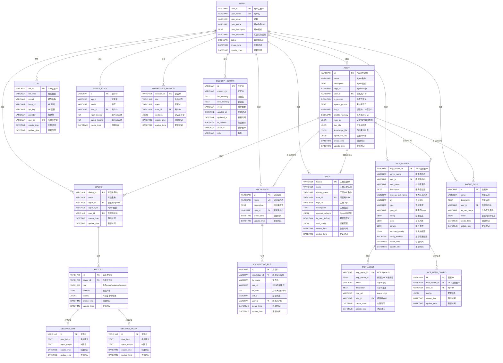

# OmniAgent - 数据库设计文档

---

## 文档信息

| 项目 | 内容 |
|------|------|
| **项目名称** | OmniAgent AI Agent 开发教学平台 |
| **文档版本** | v1.0 |
| **创建日期** | 2026-05-14 |
| **最后更新** | 2026-05-14 |
| **数据库类型** | MySQL 8.0+ |
| **字符集** | utf8mb4 |
| **排序规则** | utf8mb4_unicode_ci |
| **主键类型** | VARCHAR(32) - UUID |
| **外键策略** | 应用层维护，无物理外键约束 |

---

## 目录

1. [ER图](#1-er图)
2. [表结构设计](#2-表结构设计)
3. [表对比说明](#3-表对比说明)

---

## 1. ER图

### 1.1 整体ER图



### 1.2 核心实体关系

**USER ↔ DIALOG**
- 关系类型：1:N
- 关联字段：`user_id` → `dialog.user_id`
- 说明：一个用户可以创建多个对话

**USER ↔ AGENT**
- 关系类型：1:N
- 关联字段：`user_id` → `agent.user_id`
- 说明：一个用户可以创建多个Agent

**AGENT ↔ DIALOG**
- 关系类型：1:N
- 关联字段：`agent.id` → `dialog.agent_id`
- 说明：一个Agent可以被多个对话使用

**DIALOG ↔ MESSAGE**
- 关系类型：1:N
- 关联字段：`dialog_id` → `message.dialog_id`
- 说明：一个对话包含多条消息

**MESSAGE ↔ MESSAGE_LIKE / MESSAGE_DOWN**
- 关系类型：1:N
- 关联字段：`message_id` → `message_like.message_id`
- 说明：一条消息可以被多个用户点赞/点踩

**USER ↔ MESSAGE_LIKE / MESSAGE_DOWN**
- 关系类型：1:N
- 关联字段：`user_id` → `message_like.user_id`
- 说明：一个用户可以点赞/点踩多条消息

**KNOWLEDGE ↔ DOCUMENT**
- 关系类型：1:N
- 关联字段：`knowledge_id` → `document.knowledge_id`
- 说明：一个知识库包含多个文档

**AGENT ↔ KNOWLEDGE**
- 关系类型：N:N（通过JSON字段维护）
- 关联字段：`agent.knowledge_ids` 存储知识库ID数组
- 说明：一个Agent可以关联多个知识库，一个知识库可被多个Agent使用

**AGENT ↔ TOOL**
- 关系类型：N:N（通过JSON字段维护）
- 关联字段：`agent.tool_ids` 存储工具ID数组
- 说明：一个Agent可以配置多个工具

**AGENT ↔ MCP_SERVER**
- 关系类型：N:N（通过JSON字段维护）
- 关联字段：`agent.mcp_ids` 存储MCP服务器ID数组
- 说明：一个Agent可以连接多个MCP服务器

---

## 2. 表结构设计

### 2.1 user_table（用户表）

**表说明：** 存储用户基本信息，支持用户注册、登录、个人资料管理

**建表语句：**

```sql
CREATE TABLE `user_table` (
  `user_id` VARCHAR(32) NOT NULL COMMENT '用户主键ID',
  `user_name` VARCHAR(128) NOT NULL COMMENT '用户名',
  `user_email` VARCHAR(256) DEFAULT NULL COMMENT '邮箱',
  `user_avatar` VARCHAR(512) DEFAULT NULL COMMENT '用户头像URL',
  `user_description` TEXT DEFAULT NULL COMMENT '用户描述',
  `user_password` VARCHAR(256) NOT NULL COMMENT '加密后的密码',
  `delete` BOOLEAN DEFAULT FALSE COMMENT '软删除标记',
  `create_time` DATETIME NOT NULL DEFAULT CURRENT_TIMESTAMP COMMENT '创建时间',
  `update_time` DATETIME NOT NULL DEFAULT CURRENT_TIMESTAMP ON UPDATE CURRENT_TIMESTAMP COMMENT '更新时间',
  
  PRIMARY KEY (`user_id`),
  UNIQUE KEY `uk_user_name` (`user_name`),
  KEY `idx_create_time` (`create_time`),
  KEY `idx_update_time` (`update_time`)
) ENGINE=InnoDB DEFAULT CHARSET=utf8mb4 COLLATE=utf8mb4_unicode_ci COMMENT='用户表';
```

**字段说明：**

| 字段名 | 类型 | 长度 | 允许空 | 默认值 | 说明 |
|--------|------|------|--------|--------|------|
| user_id | VARCHAR | 32 | NO | - | 用户主键ID，使用UUID |
| user_name | VARCHAR | 128 | NO | - | 用户名，唯一索引 |
| user_email | VARCHAR | 256 | YES | NULL | 邮箱地址 |
| user_avatar | VARCHAR | 512 | YES | NULL | 用户头像URL |
| user_description | TEXT | - | YES | NULL | 用户自我描述 |
| user_password | VARCHAR | 256 | NO | - | 加密后的密码（bcrypt） |
| delete | BOOLEAN | - | NO | FALSE | 软删除标记 |
| create_time | DATETIME | - | NO | CURRENT_TIMESTAMP | 创建时间 |
| update_time | DATETIME | - | NO | CURRENT_TIMESTAMP | 更新时间，自动更新 |

**索引说明：**

| 索引名 | 类型 | 字段 | 说明 |
|--------|------|------|------|
| PRIMARY | 主键 | user_id | 主键索引 |
| uk_user_name | 唯一索引 | user_name | 用户名唯一性约束 |
| idx_create_time | 普通索引 | create_time | 创建时间查询优化 |
| idx_update_time | 普通索引 | update_time | 更新时间查询优化 |

---

### 2.2 agent_table（Agent表）

**表说明：** 存储AI Agent的配置信息，包括提示词、模型选择、能力配置等

**建表语句：**

```sql
CREATE TABLE `agent` (
  `id` VARCHAR(32) NOT NULL COMMENT 'Agent主键ID',
  `name` VARCHAR(128) NOT NULL COMMENT 'Agent的名称',
  `description` TEXT DEFAULT '' COMMENT 'Agent的描述',
  `logo_url` VARCHAR(512) DEFAULT NULL COMMENT 'Agent的Logo URL',
  `user_id` VARCHAR(32) DEFAULT NULL COMMENT 'Agent绑定的用户ID',
  `is_custom` BOOLEAN DEFAULT TRUE COMMENT 'Agent是否为用户自定义',
  `system_prompt` TEXT DEFAULT '' COMMENT 'Agent设定的系统提示词',
  `llm_id` VARCHAR(64) DEFAULT '' COMMENT 'Agent绑定的LLM模型',
  `enable_memory` BOOLEAN DEFAULT TRUE COMMENT '是否开启记忆功能',
  `mcp_ids` JSON DEFAULT NULL COMMENT 'Agent绑定的MCP Server',
  `tool_ids` JSON DEFAULT NULL COMMENT 'Agent绑定的工具列表',
  `agent_skill_ids` JSON DEFAULT NULL COMMENT 'Agent绑定的技能',
  `knowledge_ids` JSON DEFAULT NULL COMMENT 'Agent绑定的知识库',
  `create_time` DATETIME NOT NULL DEFAULT CURRENT_TIMESTAMP COMMENT '创建时间',
  `update_time` DATETIME NOT NULL DEFAULT CURRENT_TIMESTAMP ON UPDATE CURRENT_TIMESTAMP COMMENT '更新时间',
  
  PRIMARY KEY (`id`),
  KEY `idx_user_id` (`user_id`)
) ENGINE=InnoDB DEFAULT CHARSET=utf8mb4 COLLATE=utf8mb4_unicode_ci COMMENT='Agent配置表';
```

**字段说明：**

| 字段名 | 类型 | 长度 | 允许空 | 默认值 | 说明 |
|--------|------|------|--------|--------|------|
| id | VARCHAR | 32 | NO | - | Agent主键ID，使用UUID |
| name | VARCHAR | 128 | NO | - | Agent名称 |
| description | TEXT | - | YES | '' | Agent功能描述 |
| logo_url | VARCHAR | 512 | YES | NULL | Agent的Logo URL |
| user_id | VARCHAR | 32 | YES | NULL | 所属用户ID |
| is_custom | BOOLEAN | - | NO | TRUE | Agent是否为用户自定义 |
| system_prompt | TEXT | - | YES | '' | 系统提示词 |
| llm_id | VARCHAR | 64 | YES | '' | 绑定的LLM模型ID |
| enable_memory | BOOLEAN | - | NO | TRUE | 是否启用记忆功能 |
| mcp_ids | JSON | - | YES | NULL | MCP服务器ID数组 |
| tool_ids | JSON | - | YES | NULL | 工具ID数组 |
| agent_skill_ids | JSON | - | YES | NULL | 技能ID数组 |
| knowledge_ids | JSON | - | YES | NULL | 知识库ID数组 |
| create_time | DATETIME | - | NO | CURRENT_TIMESTAMP | 创建时间 |
| update_time | DATETIME | - | NO | CURRENT_TIMESTAMP | 更新时间 |

**索引说明：**

| 索引名 | 类型 | 字段 | 说明 |
|--------|------|------|------|
| PRIMARY | 主键 | id | 主键索引 |
| idx_user_id | 普通索引 | user_id | 用户维度查询优化 |

**JSON字段示例：**

```json
// mcp_ids
["mcp_server_001", "mcp_server_002"]

// tool_ids
["tool_weather", "tool_search", "tool_calculator"]

// knowledge_ids
["knowledge_001", "knowledge_002"]
```

---

### 2.3 dialog_table（对话表）

**表说明：** 存储用户的对话会话信息，每个对话绑定一个Agent

**建表语句：**

```sql
CREATE TABLE `dialog_table` (
  `dialog_id` VARCHAR(32) NOT NULL COMMENT '对话主键ID',
  `name` VARCHAR(128) DEFAULT NULL COMMENT '对话名称',
  `agent_id` VARCHAR(32) NOT NULL COMMENT '绑定的Agent ID',
  `agent_type` VARCHAR(32) DEFAULT NULL COMMENT 'Agent类型',
  `user_id` VARCHAR(32) NOT NULL COMMENT '所属用户ID',
  `create_time` DATETIME NOT NULL DEFAULT CURRENT_TIMESTAMP COMMENT '创建时间',
  `update_time` DATETIME NOT NULL DEFAULT CURRENT_TIMESTAMP ON UPDATE CURRENT_TIMESTAMP COMMENT '更新时间',
  
  PRIMARY KEY (`dialog_id`),
  KEY `idx_agent_id` (`agent_id`),
  KEY `idx_user_id` (`user_id`),
  KEY `idx_create_time` (`create_time`)
) ENGINE=InnoDB DEFAULT CHARSET=utf8mb4 COLLATE=utf8mb4_unicode_ci COMMENT='对话表';
```

**字段说明：**

| 字段名 | 类型 | 长度 | 允许空 | 默认值 | 说明 |
|--------|------|------|--------|--------|------|
| dialog_id | VARCHAR | 32 | NO | - | 对话主键ID，使用UUID |
| name | VARCHAR | 128 | YES | NULL | 对话名称 |
| agent_id | VARCHAR | 32 | NO | - | 绑定的Agent ID |
| agent_type | VARCHAR | 32 | YES | NULL | Agent类型（General/React/MCP等） |
| user_id | VARCHAR | 32 | NO | - | 所属用户ID |
| create_time | DATETIME | - | NO | CURRENT_TIMESTAMP | 创建时间 |
| update_time | DATETIME | - | NO | CURRENT_TIMESTAMP | 更新时间 |

**索引说明：**

| 索引名 | 类型 | 字段 | 说明 |
|--------|------|------|------|
| PRIMARY | 主键 | dialog_id | 主键索引 |
| idx_agent_id | 普通索引 | agent_id | Agent维度查询 |
| idx_user_id | 普通索引 | user_id | 用户维度查询 |
| idx_create_time | 普通索引 | create_time | 时间排序查询 |

---

### 2.4 history_table（消息表）

**表说明：** 存储对话中的所有消息记录，包括用户消息和AI回复，以及AI回复的事件信息

**建表语句：**

```sql
CREATE TABLE `history` (
  `id` VARCHAR(32) NOT NULL COMMENT '消息主键ID',
  `content` TEXT NOT NULL COMMENT '消息内容',
  `dialog_id` VARCHAR(32) NOT NULL COMMENT '所属对话ID',
  `role` VARCHAR(16) NOT NULL COMMENT '角色(user/assistant/system)',
  `events` JSON DEFAULT NULL COMMENT 'AI回复事件信息',
  `create_time` DATETIME NOT NULL DEFAULT CURRENT_TIMESTAMP COMMENT '创建时间',
  `update_time` DATETIME NOT NULL DEFAULT CURRENT_TIMESTAMP ON UPDATE CURRENT_TIMESTAMP COMMENT '更新时间',
  
  PRIMARY KEY (`id`),
  KEY `idx_dialog_id` (`dialog_id`),
  KEY `idx_create_time` (`create_time`)
) ENGINE=InnoDB DEFAULT CHARSET=utf8mb4 COLLATE=utf8mb4_unicode_ci COMMENT='消息历史表';
```

**字段说明：**

| 字段名 | 类型 | 长度 | 允许空 | 默认值 | 说明 |
|--------|------|------|--------|--------|------|
| id | VARCHAR | 32 | NO | - | 消息主键ID，使用UUID |
| content | TEXT | - | NO | - | 消息内容 |
| dialog_id | VARCHAR | 32 | NO | - | 所属对话ID |
| role | VARCHAR | 16 | NO | - | 角色：user/assistant/system |
| events | JSON | - | YES | NULL | AI回复事件信息 {'type': 'event', 'data': ....} |
| create_time | DATETIME | - | NO | CURRENT_TIMESTAMP | 创建时间 |
| update_time | DATETIME | - | NO | CURRENT_TIMESTAMP | 更新时间 |

**索引说明：**

| 索引名 | 类型 | 字段 | 说明 |
|--------|------|------|------|
| PRIMARY | 主键 | id | 主键索引 |
| idx_dialog_id | 普通索引 | dialog_id | 对话历史查询 |
| idx_create_time | 普通索引 | create_time | 时间排序查询 |

**role字段枚举值：**

| 值 | 说明 |
|----|------|
| user | 用户消息 |
| assistant | AI助手回复 |
| system | 系统消息 |

---

### 2.5 message_like_table（消息点赞表）

**表说明：** 存储用户对消息的点赞记录

**建表语句：**

```sql
CREATE TABLE `message_like` (
  `id` VARCHAR(32) NOT NULL COMMENT '主键ID',
  `user_input` TEXT DEFAULT NULL COMMENT '用户输入',
  `agent_output` TEXT DEFAULT NULL COMMENT 'AI回复',
  `create_time` DATETIME NOT NULL DEFAULT CURRENT_TIMESTAMP COMMENT '创建时间',
  `update_time` DATETIME NOT NULL DEFAULT CURRENT_TIMESTAMP ON UPDATE CURRENT_TIMESTAMP COMMENT '更新时间',
  
  PRIMARY KEY (`id`)
) ENGINE=InnoDB DEFAULT CHARSET=utf8mb4 COLLATE=utf8mb4_unicode_ci COMMENT='消息点赞表';
```

**字段说明：**

| 字段名 | 类型 | 长度 | 允许空 | 默认值 | 说明 |
|--------|------|------|--------|--------|------|
| id | VARCHAR | 32 | NO | - | 主键ID，使用UUID |
| user_input | TEXT | - | YES | NULL | 用户输入内容 |
| agent_output | TEXT | - | YES | NULL | AI回复内容 |
| create_time | DATETIME | - | NO | CURRENT_TIMESTAMP | 创建时间 |
| update_time | DATETIME | - | NO | CURRENT_TIMESTAMP | 更新时间 |

**索引说明：**

| 索引名 | 类型 | 字段 | 说明 |
|--------|------|------|------|
| PRIMARY | 主键 | id | 主键索引 |

---

### 2.6 message_down_table（消息点踩表）

**表说明：** 存储用户对消息的点踩记录

**建表语句：**

```sql
CREATE TABLE `message_down` (
  `id` VARCHAR(32) NOT NULL COMMENT '主键ID',
  `user_input` TEXT DEFAULT NULL COMMENT '用户输入',
  `agent_output` TEXT DEFAULT NULL COMMENT 'AI回复',
  `create_time` DATETIME NOT NULL DEFAULT CURRENT_TIMESTAMP COMMENT '创建时间',
  `update_time` DATETIME NOT NULL DEFAULT CURRENT_TIMESTAMP ON UPDATE CURRENT_TIMESTAMP COMMENT '更新时间',
  
  PRIMARY KEY (`id`)
) ENGINE=InnoDB DEFAULT CHARSET=utf8mb4 COLLATE=utf8mb4_unicode_ci COMMENT='消息点踩表';
```

**字段说明：**

| 字段名 | 类型 | 长度 | 允许空 | 默认值 | 说明 |
|--------|------|------|--------|--------|------|
| id | VARCHAR | 32 | NO | - | 主键ID，使用UUID |
| user_input | TEXT | - | YES | NULL | 用户输入内容 |
| agent_output | TEXT | - | YES | NULL | AI回复内容 |
| create_time | DATETIME | - | NO | CURRENT_TIMESTAMP | 创建时间 |
| update_time | DATETIME | - | NO | CURRENT_TIMESTAMP | 更新时间 |

**索引说明：**

| 索引名 | 类型 | 字段 | 说明 |
|--------|------|------|------|
| PRIMARY | 主键 | id | 主键索引 |

---

### 2.7 knowledge_table（知识库表）

**表说明：** 存储用户创建的知识库信息

**建表语句：**

```sql
CREATE TABLE `knowledge_table` (
  `id` VARCHAR(32) NOT NULL COMMENT '知识库ID',
  `name` VARCHAR(128) NOT NULL COMMENT '知识库名称',
  `description` TEXT DEFAULT NULL COMMENT '知识库描述',
  `user_id` VARCHAR(32) NOT NULL COMMENT '所属用户ID',
  `create_time` DATETIME NOT NULL DEFAULT CURRENT_TIMESTAMP COMMENT '创建时间',
  `update_time` DATETIME NOT NULL DEFAULT CURRENT_TIMESTAMP ON UPDATE CURRENT_TIMESTAMP COMMENT '更新时间',
  
  PRIMARY KEY (`id`),
  UNIQUE KEY `uk_name` (`name`),
  KEY `idx_user_id` (`user_id`)
) ENGINE=InnoDB DEFAULT CHARSET=utf8mb4 COLLATE=utf8mb4_unicode_ci COMMENT='知识库表';
```

**字段说明：**

| 字段名 | 类型 | 长度 | 允许空 | 默认值 | 说明 |
|--------|------|------|--------|--------|------|
| id | VARCHAR | 32 | NO | - | 知识库ID，使用UUID |
| name | VARCHAR | 128 | NO | - | 知识库名称，唯一索引 |
| description | TEXT | - | YES | NULL | 知识库描述 |
| user_id | VARCHAR | 32 | NO | - | 所属用户ID |
| create_time | DATETIME | - | NO | CURRENT_TIMESTAMP | 创建时间 |
| update_time | DATETIME | - | NO | CURRENT_TIMESTAMP | 更新时间 |

**索引说明：**

| 索引名 | 类型 | 字段 | 说明 |
|--------|------|------|------|
| PRIMARY | 主键 | id | 主键索引 |
| uk_name | 唯一索引 | name | 知识库名称唯一性 |
| idx_user_id | 普通索引 | user_id | 用户维度查询 |

---

### 2.8 knowledge_file_table（知识库文件表）

**表说明：** 存储知识库中的文档信息，记录文档处理状态和元数据

**建表语句：**

```sql
CREATE TABLE `knowledge_file` (
  `id` VARCHAR(32) NOT NULL COMMENT '文档ID',
  `file_name` VARCHAR(256) NOT NULL COMMENT '文件名',
  `knowledge_id` VARCHAR(32) NOT NULL COMMENT '知识库的ID',
  `status` VARCHAR(16) DEFAULT 'success' COMMENT '文件解析的状态',
  `user_id` VARCHAR(32) NOT NULL COMMENT '用户ID',
  `oss_url` VARCHAR(512) DEFAULT '' COMMENT '知识库文件保存到oss的路径',
  `file_size` INT DEFAULT 0 COMMENT '文件大小（单位：字节），如317440表示310KB',
  `create_time` DATETIME NOT NULL DEFAULT CURRENT_TIMESTAMP COMMENT '创建时间',
  `update_time` DATETIME NOT NULL DEFAULT CURRENT_TIMESTAMP ON UPDATE CURRENT_TIMESTAMP COMMENT '更新时间',
  
  PRIMARY KEY (`id`),
  KEY `idx_file_name` (`file_name`),
  KEY `idx_knowledge_id` (`knowledge_id`),
  KEY `idx_user_id` (`user_id`)
) ENGINE=InnoDB DEFAULT CHARSET=utf8mb4 COLLATE=utf8mb4_unicode_ci COMMENT='知识库文件表';
```

**字段说明：**

| 字段名 | 类型 | 长度 | 允许空 | 默认值 | 说明 |
|--------|------|------|--------|--------|------|
| id | VARCHAR | 32 | NO | - | 文档ID，使用UUID |
| file_name | VARCHAR | 256 | NO | - | 文件名 |
| knowledge_id | VARCHAR | 32 | NO | - | 知识库的ID |
| status | VARCHAR | 16 | YES | success | 文件解析的状态 |
| user_id | VARCHAR | 32 | NO | - | 用户ID |
| oss_url | VARCHAR | 512 | YES | '' | 知识库文件保存到oss的路径 |
| file_size | INT | - | YES | 0 | 文件大小（单位：字节） |
| create_time | DATETIME | - | NO | CURRENT_TIMESTAMP | 创建时间 |
| update_time | DATETIME | - | NO | CURRENT_TIMESTAMP | 更新时间 |

**索引说明：**

| 索引名 | 类型 | 字段 | 说明 |
|--------|------|------|------|
| PRIMARY | 主键 | id | 主键索引 |
| idx_file_name | 普通索引 | file_name | 文件名查询 |
| idx_knowledge_id | 普通索引 | knowledge_id | 知识库维度查询 |
| idx_user_id | 普通索引 | user_id | 用户维度查询 |

**status字段枚举值：**

| 值 | 说明 |
|----|------|
| fail | 解析失败 |
| process | 解析中 |
| success | 解析成功 |

---

### 2.9 llm_table（LLM模型配置表）

**表说明：** 存储用户配置的大模型信息

**建表语句：**

```sql
CREATE TABLE `llm` (
  `llm_id` VARCHAR(32) NOT NULL COMMENT 'LLM主键ID',
  `llm_type` VARCHAR(16) DEFAULT 'LLM' COMMENT '大模型的类型, 分LLM、Embedding、Rerank',
  `model` VARCHAR(128) NOT NULL COMMENT '大模型的名称',
  `base_url` VARCHAR(512) NOT NULL COMMENT '大模型的base url',
  `api_key` VARCHAR(256) NOT NULL COMMENT '大模型的api key',
  `provider` VARCHAR(64) NOT NULL COMMENT '大模型的提供商',
  `user_id` VARCHAR(32) NOT NULL COMMENT '大模型创建者的ID',
  `create_time` DATETIME NOT NULL DEFAULT CURRENT_TIMESTAMP COMMENT '创建时间',
  `update_time` DATETIME NOT NULL DEFAULT CURRENT_TIMESTAMP ON UPDATE CURRENT_TIMESTAMP COMMENT '更新时间',

  PRIMARY KEY (`llm_id`)
) ENGINE=InnoDB DEFAULT CHARSET=utf8mb4 COLLATE=utf8mb4_unicode_ci COMMENT='LLM模型配置表';
```

**字段说明：**

| 字段名 | 类型 | 长度 | 允许空 | 默认值 | 说明 |
|--------|------|------|--------|--------|------|
| llm_id | VARCHAR | 32 | NO | - | LLM主键ID，使用UUID |
| llm_type | VARCHAR | 16 | YES | LLM | 大模型类型 |
| model | VARCHAR | 128 | NO | - | 大模型的名称 |
| base_url | VARCHAR | 512 | NO | - | 大模型的base url |
| api_key | VARCHAR | 256 | NO | - | 大模型的api key |
| provider | VARCHAR | 64 | NO | - | 大模型的提供商 |
| user_id | VARCHAR | 32 | NO | - | 大模型创建者的ID |
| create_time | DATETIME | - | NO | CURRENT_TIMESTAMP | 创建时间 |
| update_time | DATETIME | - | NO | CURRENT_TIMESTAMP | 更新时间 |

---

### 2.10 tool_table（工具表）

**表说明：** 存储用户创建或导入的工具信息

**建表语句：**

```sql
CREATE TABLE `tool` (
  `tool_id` VARCHAR(32) NOT NULL COMMENT '工具主键ID',
  `name` VARCHAR(128) DEFAULT NULL COMMENT '工具的英文名称，大模型调用',
  `display_name` VARCHAR(128) NOT NULL COMMENT '工具的中文名称，显示给用户',
  `user_id` VARCHAR(32) NOT NULL COMMENT '该工具对应的创建用户',
  `logo_url` VARCHAR(512) DEFAULT NULL COMMENT '工具对应的Logo地址',
  `description` TEXT DEFAULT NULL COMMENT '大模型将根据此描述识别并调用该工具',
  `openapi_schema` JSON DEFAULT NULL COMMENT '用户自定义添加工具的格式',
  `is_user_defined` BOOLEAN DEFAULT FALSE COMMENT '代表是否是自定义的工具',
  `auth_config` JSON DEFAULT NULL COMMENT '用户的鉴权信息',
  `create_time` DATETIME NOT NULL DEFAULT CURRENT_TIMESTAMP COMMENT '创建时间',
  `update_time` DATETIME NOT NULL DEFAULT CURRENT_TIMESTAMP ON UPDATE CURRENT_TIMESTAMP COMMENT '更新时间',

  PRIMARY KEY (`tool_id`)
) ENGINE=InnoDB DEFAULT CHARSET=utf8mb4 COLLATE=utf8mb4_unicode_ci COMMENT='工具表';
```

**字段说明：**

| 字段名 | 类型 | 长度 | 允许空 | 默认值 | 说明 |
|--------|------|------|--------|--------|------|
| tool_id | VARCHAR | 32 | NO | - | 工具主键ID，使用UUID |
| name | VARCHAR | 128 | YES | NULL | 工具的英文名称 |
| display_name | VARCHAR | 128 | NO | - | 工具的中文名称 |
| user_id | VARCHAR | 32 | NO | - | 该工具对应的创建用户 |
| logo_url | VARCHAR | 512 | YES | NULL | 工具对应的Logo地址 |
| description | TEXT | - | YES | NULL | 工具描述 |
| openapi_schema | JSON | - | YES | NULL | OpenAPI规范 |
| is_user_defined | BOOLEAN | - | NO | FALSE | 是否是自定义的工具 |
| auth_config | JSON | - | YES | NULL | 用户的鉴权信息 |
| create_time | DATETIME | - | NO | CURRENT_TIMESTAMP | 创建时间 |
| update_time | DATETIME | - | NO | CURRENT_TIMESTAMP | 更新时间 |

---

### 2.11 mcp_server_table（MCP服务器表）

**表说明：** 存储MCP服务器的配置信息

**建表语句：**

```sql
CREATE TABLE `mcp_server` (
  `mcp_server_id` VARCHAR(32) NOT NULL COMMENT 'MCP服务器ID',
  `server_name` VARCHAR(128) DEFAULT 'MCP Server' COMMENT 'MCP Server名称',
  `user_id` VARCHAR(32) NOT NULL COMMENT 'MCP Server对应的创建用户',
  `user_name` VARCHAR(128) NOT NULL COMMENT 'MCP Server创建者的名称',
  `description` TEXT DEFAULT NULL COMMENT '该MCP Server的描述',
  `mcp_as_tool_name` VARCHAR(128) DEFAULT NULL COMMENT '用来当作sub-agent使用时的名称',
  `url` VARCHAR(512) NOT NULL COMMENT 'MCP Server的连接地址',
  `type` VARCHAR(255) NOT NULL COMMENT '连接类型，只允许三种，sse、websocket、stdio',
  `logo_url` VARCHAR(512) DEFAULT NULL COMMENT 'MCP Server的logo地址',
  `config` JSON DEFAULT NULL COMMENT '配置，如apikey等',
  `tools` JSON DEFAULT NULL COMMENT 'MCP Server的工具列表',
  `params` JSON DEFAULT NULL COMMENT '输入参数',
  `imported_config` JSON DEFAULT NULL COMMENT '用户导入的配置参数',
  `config_enabled` BOOLEAN DEFAULT FALSE COMMENT '是否需要用户单独配置参数',
  `create_time` DATETIME NOT NULL DEFAULT CURRENT_TIMESTAMP COMMENT '创建时间',
  `update_time` DATETIME NOT NULL DEFAULT CURRENT_TIMESTAMP ON UPDATE CURRENT_TIMESTAMP COMMENT '更新时间',

  PRIMARY KEY (`mcp_server_id`)
) ENGINE=InnoDB DEFAULT CHARSET=utf8mb4 COLLATE=utf8mb4_unicode_ci COMMENT='MCP服务器表';
```

**字段说明：**

| 字段名 | 类型 | 长度 | 允许空 | 默认值 | 说明 |
|--------|------|------|--------|--------|------|
| mcp_server_id | VARCHAR | 32 | NO | - | MCP服务器ID |
| server_name | VARCHAR | 128 | YES | MCP Server | MCP Server名称 |
| user_id | VARCHAR | 32 | NO | - | 对应的创建用户 |
| user_name | VARCHAR | 128 | NO | - | 创建者的名称 |
| description | TEXT | - | YES | NULL | 服务器描述 |
| mcp_as_tool_name | VARCHAR | 128 | YES | NULL | 作为工具名称 |
| url | VARCHAR | 512 | NO | - | 连接地址 |
| type | VARCHAR | 255 | NO | - | 连接类型 |
| logo_url | VARCHAR | 512 | YES | NULL | Logo地址 |
| config | JSON | - | YES | NULL | 配置信息 |
| tools | JSON | - | YES | NULL | 工具列表 |
| params | JSON | - | YES | NULL | 输入参数 |
| imported_config | JSON | - | YES | NULL | 导入的配置 |
| config_enabled | BOOLEAN | - | NO | FALSE | 是否需要用户配置 |
| create_time | DATETIME | - | NO | CURRENT_TIMESTAMP | 创建时间 |
| update_time | DATETIME | - | NO | CURRENT_TIMESTAMP | 更新时间 |

**type字段枚举值：**

| 值 | 说明 |
|----|------|
| sse | SSE连接 |
| websocket | WebSocket连接 |
| stdio | 标准输入输出连接 |

---

### 2.12 mcp_stdio_server_table（MCP Stdio服务器表）

**表说明：** 存储通过stdio方式启动的MCP服务器配置

**建表语句：**

```sql
CREATE TABLE `mcp_stdio_server` (
  `mcp_server_id` VARCHAR(32) NOT NULL COMMENT 'MCP服务器ID',
  `mcp_server_path` VARCHAR(512) NOT NULL COMMENT 'MCP Server脚本所在位置',
  `mcp_server_command` VARCHAR(512) NOT NULL COMMENT 'MCP Server脚本执行命令',
  `mcp_server_env` TEXT DEFAULT NULL COMMENT 'MCP Server脚本环境变量',
  `user_id` VARCHAR(32) NOT NULL COMMENT '对应的创建用户',
  `name` VARCHAR(128) DEFAULT 'MCP Server' COMMENT 'MCP Server名称',
  `create_time` DATETIME NOT NULL DEFAULT CURRENT_TIMESTAMP COMMENT '创建时间',

  PRIMARY KEY (`mcp_server_id`)
) ENGINE=InnoDB DEFAULT CHARSET=utf8mb4 COLLATE=utf8mb4_unicode_ci COMMENT='MCP Stdio服务器表';
```

---

### 2.13 mcp_agent_table（MCP Agent表）

**表说明：** 存储MCP Agent的配置信息

**建表语句：**

```sql
CREATE TABLE `mcp_agent` (
  `mcp_agent_id` VARCHAR(32) NOT NULL COMMENT 'MCP Agent ID',
  `mcp_server_id` JSON DEFAULT NULL COMMENT 'MCPAgent绑定的工具列表',
  `name` VARCHAR(128) DEFAULT '' COMMENT 'MCP Agent的名称',
  `description` TEXT DEFAULT '' COMMENT 'MCP Agent的描述',
  `logo_url` VARCHAR(512) DEFAULT 'img/mcp_openai/mcp_agent.png' COMMENT 'MCP Agent的Logo',
  `user_id` VARCHAR(32) DEFAULT NULL COMMENT '所属用户ID',
  `create_time` DATETIME NOT NULL DEFAULT CURRENT_TIMESTAMP COMMENT '创建时间',
  `update_time` DATETIME NOT NULL DEFAULT CURRENT_TIMESTAMP ON UPDATE CURRENT_TIMESTAMP COMMENT '更新时间',

  PRIMARY KEY (`mcp_agent_id`),
  KEY `idx_user_id` (`user_id`)
) ENGINE=InnoDB DEFAULT CHARSET=utf8mb4 COLLATE=utf8mb4_unicode_ci COMMENT='MCP Agent表';
```

---

### 2.14 mcp_user_config_table（MCP用户配置表）

**表说明：** 存储用户与MCP Server的绑定配置信息

**建表语句：**

```sql
CREATE TABLE `mcp_user_config` (
  `id` VARCHAR(32) NOT NULL COMMENT '主键ID',
  `mcp_server_id` VARCHAR(32) NOT NULL COMMENT '绑定的MCP Server ID',
  `user_id` VARCHAR(32) NOT NULL COMMENT '绑定到该MCP Server的用户ID',
  `config` JSON DEFAULT NULL COMMENT '针对一些需要鉴权的MCP Server的配置信息',
  `create_time` DATETIME NOT NULL DEFAULT CURRENT_TIMESTAMP COMMENT '创建时间',
  `update_time` DATETIME NOT NULL DEFAULT CURRENT_TIMESTAMP ON UPDATE CURRENT_TIMESTAMP COMMENT '更新时间',

  PRIMARY KEY (`id`)
) ENGINE=InnoDB DEFAULT CHARSET=utf8mb4 COLLATE=utf8mb4_unicode_ci COMMENT='MCP用户配置表';
```

---

### 2.15 agent_skill_table（Agent技能表）

**表说明：** 存储Agent技能的配置信息

**建表语句：**

```sql
CREATE TABLE `agent_skill` (
  `id` VARCHAR(32) NOT NULL COMMENT 'Agent Skill的ID',
  `name` VARCHAR(128) NOT NULL COMMENT 'Agent Skill的名称',
  `description` TEXT NOT NULL COMMENT 'Agent Skill的描述信息',
  `user_id` VARCHAR(32) NOT NULL COMMENT 'Agent Skill的拥有者',
  `as_tool_name` VARCHAR(128) DEFAULT NULL COMMENT 'Agent Skill当作Tool的名称',
  `folder` JSON DEFAULT NULL COMMENT '存放的是Agent Skill的目录以及文件信息',
  `create_time` DATETIME NOT NULL DEFAULT CURRENT_TIMESTAMP COMMENT '创建时间',
  `update_time` DATETIME NOT NULL DEFAULT CURRENT_TIMESTAMP ON UPDATE CURRENT_TIMESTAMP COMMENT '修改时间',

  PRIMARY KEY (`id`)
) ENGINE=InnoDB DEFAULT CHARSET=utf8mb4 COLLATE=utf8mb4_unicode_ci COMMENT='Agent技能表';
```

---

### 2.16 usage_stats_table（使用统计表）

**表说明：** 存储智能体和模型的使用统计信息

**建表语句：**

```sql
CREATE TABLE `usage_stats` (
  `id` VARCHAR(32) NOT NULL COMMENT '统计ID',
  `agent` VARCHAR(128) DEFAULT NULL COMMENT '使用统计的智能体',
  `model` VARCHAR(128) DEFAULT NULL COMMENT '使用统计的模型',
  `user_id` VARCHAR(32) NOT NULL COMMENT '发起请求的用户唯一标识',
  `input_tokens` INT DEFAULT 0 COMMENT '输入所消耗的token数量',
  `output_tokens` INT DEFAULT 0 COMMENT '模型生成所消耗的token数量',
  `create_time` DATETIME NOT NULL DEFAULT CURRENT_TIMESTAMP COMMENT '创建时间',

  PRIMARY KEY (`id`)
) ENGINE=InnoDB DEFAULT CHARSET=utf8mb4 COLLATE=utf8mb4_unicode_ci COMMENT='使用统计表';
```

---

### 2.17 workspace_session_table（工作台会话表）

**表说明：** 存储工作台会话的信息

**建表语句：**

```sql
CREATE TABLE `workspace_session` (
  `session_id` VARCHAR(32) NOT NULL COMMENT '工作台的会话ID',
  `title` VARCHAR(256) NOT NULL COMMENT '工作台会话的标题',
  `agent` VARCHAR(128) NOT NULL COMMENT '工作台中选用的智能体',
  `user_id` VARCHAR(32) NOT NULL COMMENT '工作台会话对应的User ID',
  `contexts` JSON DEFAULT NULL COMMENT 'JSON, 含tasks、questions、answers、guide_prompts四个字段的结构化对话上下文',
  `create_time` DATETIME NOT NULL DEFAULT CURRENT_TIMESTAMP COMMENT '创建时间',
  `update_time` DATETIME NOT NULL DEFAULT CURRENT_TIMESTAMP ON UPDATE CURRENT_TIMESTAMP COMMENT '更新时间',

  PRIMARY KEY (`session_id`)
) ENGINE=InnoDB DEFAULT CHARSET=utf8mb4 COLLATE=utf8mb4_unicode_ci COMMENT='工作台会话表';
```

---

### 2.18 memory_history_table（记忆历史表）

**表说明：** 存储记忆操作的历史记录

**建表语句：**

```sql
CREATE TABLE `memory_history` (
  `id` VARCHAR(32) NOT NULL COMMENT '主键ID',
  `memory_id` VARCHAR(32) NOT NULL COMMENT '记忆ID',
  `old_memory` TEXT DEFAULT NULL COMMENT '旧记忆内容',
  `new_memory` TEXT DEFAULT NULL COMMENT '新记忆内容',
  `event` VARCHAR(64) NOT NULL COMMENT '事件类型',
  `created_at` DATETIME NOT NULL DEFAULT CURRENT_TIMESTAMP COMMENT '创建时间',
  `updated_at` DATETIME NOT NULL DEFAULT CURRENT_TIMESTAMP ON UPDATE CURRENT_TIMESTAMP COMMENT '更新时间',
  `is_deleted` BOOLEAN DEFAULT FALSE COMMENT '是否删除',
  `actor_id` VARCHAR(32) DEFAULT NULL COMMENT '操作者ID',
  `role` VARCHAR(64) DEFAULT NULL COMMENT '角色',

  PRIMARY KEY (`id`)
) ENGINE=InnoDB DEFAULT CHARSET=utf8mb4 COLLATE=utf8mb4_unicode_ci COMMENT='记忆历史表';
```

---

## 3. 表对比说明

### 3.1 表名变更

| 原文档表名 | 实际表名 | 说明 |
|-----------|----------|------|
| user_table | user | 简化表名 |
| agent_table | agent | 简化表名 |
| dialog_table | dialog | 简化表名 |
| message_table | history | 更准确地反映消息历史 |
| message_like_table | message_like | 简化表名 |
| message_down_table | message_down | 简化表名 |
| knowledge_table | knowledge | 简化表名 |
| document_table | knowledge_file | 更准确地反映知识库文件 |

### 3.2 新增表

| 表名 | 说明 |
|------|------|
| llm | LLM模型配置表 |
| tool | 工具管理表 |
| mcp_server | MCP服务器表 |
| mcp_stdio_server | MCP Stdio服务器表 |
| mcp_agent | MCP Agent表 |
| mcp_user_config | MCP用户配置表 |
| agent_skill | Agent技能表 |
| usage_stats | 使用统计表 |
| workspace_session | 工作台会话表 |
| memory_history | 记忆历史表 |

### 3.3 字段差异

**agent表新增字段：**
- `logo_url`: Agent的Logo URL
- `is_custom`: 是否为用户自定义
- `agent_skill_ids`: 绑定的技能ID列表

**history表（原message_table）新增字段：**
- `events`: AI回复事件信息（JSON类型）
- `update_time`: 更新时间

**knowledge_file表（原document_table）字段变更：**
- `file_path` → `oss_url`: 使用OSS存储路径
- 新增 `user_id` 字段
- 删除 `chunk_count` 字段
- status枚举值变更：processing/process, completed/success, failed/fail

**message_like/message_down表结构变更：**
- 删除 `message_id` 和 `user_id` 外键字段
- 改为存储 `user_input` 和 `agent_output` 内容

---

## 附录：数据库初始化脚本

```sql
-- 创建数据库
CREATE DATABASE IF NOT EXISTS `agentchat`
DEFAULT CHARACTER SET utf8mb4
COLLATE utf8mb4_unicode_ci;

USE `agentchat`;

-- 创建表（按依赖顺序）
-- 1. 用户表
CREATE TABLE `user` (
  `user_id` VARCHAR(32) NOT NULL COMMENT '用户主键ID',
  `user_name` VARCHAR(128) NOT NULL COMMENT '用户名',
  `user_email` VARCHAR(256) DEFAULT NULL COMMENT '邮箱',
  `user_avatar` VARCHAR(512) DEFAULT NULL COMMENT '用户头像URL',
  `user_description` TEXT DEFAULT NULL COMMENT '用户描述',
  `user_password` VARCHAR(256) NOT NULL COMMENT '加密后的密码',
  `delete` BOOLEAN DEFAULT FALSE COMMENT '软删除标记',
  `create_time` DATETIME NOT NULL DEFAULT CURRENT_TIMESTAMP COMMENT '创建时间',
  `update_time` DATETIME NOT NULL DEFAULT CURRENT_TIMESTAMP ON UPDATE CURRENT_TIMESTAMP COMMENT '更新时间',

  PRIMARY KEY (`user_id`),
  UNIQUE KEY `uk_user_name` (`user_name`),
  KEY `idx_create_time` (`create_time`),
  KEY `idx_update_time` (`update_time`)
) ENGINE=InnoDB DEFAULT CHARSET=utf8mb4 COLLATE=utf8mb4_unicode_ci COMMENT='用户表';

-- 2. LLM模型配置表
CREATE TABLE `llm` (
  `llm_id` VARCHAR(32) NOT NULL COMMENT 'LLM主键ID',
  `llm_type` VARCHAR(16) DEFAULT 'LLM' COMMENT '大模型的类型',
  `model` VARCHAR(128) NOT NULL COMMENT '大模型的名称',
  `base_url` VARCHAR(512) NOT NULL COMMENT '大模型的base url',
  `api_key` VARCHAR(256) NOT NULL COMMENT '大模型的api key',
  `provider` VARCHAR(64) NOT NULL COMMENT '大模型的提供商',
  `user_id` VARCHAR(32) NOT NULL COMMENT '大模型创建者的ID',
  `create_time` DATETIME NOT NULL DEFAULT CURRENT_TIMESTAMP COMMENT '创建时间',
  `update_time` DATETIME NOT NULL DEFAULT CURRENT_TIMESTAMP ON UPDATE CURRENT_TIMESTAMP COMMENT '更新时间',

  PRIMARY KEY (`llm_id`)
) ENGINE=InnoDB DEFAULT CHARSET=utf8mb4 COLLATE=utf8mb4_unicode_ci COMMENT='LLM模型配置表';

-- 3. 工具表
CREATE TABLE `tool` (
  `tool_id` VARCHAR(32) NOT NULL COMMENT '工具主键ID',
  `name` VARCHAR(128) DEFAULT NULL COMMENT '工具的英文名称',
  `display_name` VARCHAR(128) NOT NULL COMMENT '工具的中文名称',
  `user_id` VARCHAR(32) NOT NULL COMMENT '该工具对应的创建用户',
  `logo_url` VARCHAR(512) DEFAULT NULL COMMENT '工具对应的Logo地址',
  `description` TEXT DEFAULT NULL COMMENT '大模型将根据此描述识别并调用该工具',
  `openapi_schema` JSON DEFAULT NULL COMMENT '用户自定义添加工具的格式',
  `is_user_defined` BOOLEAN DEFAULT FALSE COMMENT '代表是否是自定义的工具',
  `auth_config` JSON DEFAULT NULL COMMENT '用户的鉴权信息',
  `create_time` DATETIME NOT NULL DEFAULT CURRENT_TIMESTAMP COMMENT '创建时间',
  `update_time` DATETIME NOT NULL DEFAULT CURRENT_TIMESTAMP ON UPDATE CURRENT_TIMESTAMP COMMENT '更新时间',

  PRIMARY KEY (`tool_id`)
) ENGINE=InnoDB DEFAULT CHARSET=utf8mb4 COLLATE=utf8mb4_unicode_ci COMMENT='工具表';

-- 4. MCP服务器表
CREATE TABLE `mcp_server` (
  `mcp_server_id` VARCHAR(32) NOT NULL COMMENT 'MCP服务器ID',
  `server_name` VARCHAR(128) DEFAULT 'MCP Server' COMMENT 'MCP Server名称',
  `user_id` VARCHAR(32) NOT NULL COMMENT 'MCP Server对应的创建用户',
  `user_name` VARCHAR(128) NOT NULL COMMENT 'MCP Server创建者的名称',
  `description` TEXT DEFAULT NULL COMMENT '该MCP Server的描述',
  `mcp_as_tool_name` VARCHAR(128) DEFAULT NULL COMMENT '用来当作sub-agent使用时的名称',
  `url` VARCHAR(512) NOT NULL COMMENT 'MCP Server的连接地址',
  `type` VARCHAR(255) NOT NULL COMMENT '连接类型',
  `logo_url` VARCHAR(512) DEFAULT NULL COMMENT 'MCP Server的logo地址',
  `config` JSON DEFAULT NULL COMMENT '配置信息',
  `tools` JSON DEFAULT NULL COMMENT 'MCP Server的工具列表',
  `params` JSON DEFAULT NULL COMMENT '输入参数',
  `imported_config` JSON DEFAULT NULL COMMENT '用户导入的配置参数',
  `config_enabled` BOOLEAN DEFAULT FALSE COMMENT '是否需要用户单独配置参数',
  `create_time` DATETIME NOT NULL DEFAULT CURRENT_TIMESTAMP COMMENT '创建时间',
  `update_time` DATETIME NOT NULL DEFAULT CURRENT_TIMESTAMP ON UPDATE CURRENT_TIMESTAMP COMMENT '更新时间',

  PRIMARY KEY (`mcp_server_id`)
) ENGINE=InnoDB DEFAULT CHARSET=utf8mb4 COLLATE=utf8mb4_unicode_ci COMMENT='MCP服务器表';

-- 5. MCP Stdio服务器表
CREATE TABLE `mcp_stdio_server` (
  `mcp_server_id` VARCHAR(32) NOT NULL COMMENT 'MCP服务器ID',
  `mcp_server_path` VARCHAR(512) NOT NULL COMMENT 'MCP Server脚本所在位置',
  `mcp_server_command` VARCHAR(512) NOT NULL COMMENT 'MCP Server脚本执行命令',
  `mcp_server_env` TEXT DEFAULT NULL COMMENT 'MCP Server脚本环境变量',
  `user_id` VARCHAR(32) NOT NULL COMMENT '对应的创建用户',
  `name` VARCHAR(128) DEFAULT 'MCP Server' COMMENT 'MCP Server名称',
  `create_time` DATETIME NOT NULL DEFAULT CURRENT_TIMESTAMP COMMENT '创建时间',

  PRIMARY KEY (`mcp_server_id`)
) ENGINE=InnoDB DEFAULT CHARSET=utf8mb4 COLLATE=utf8mb4_unicode_ci COMMENT='MCP Stdio服务器表';

-- 6. MCP Agent表
CREATE TABLE `mcp_agent` (
  `mcp_agent_id` VARCHAR(32) NOT NULL COMMENT 'MCP Agent ID',
  `mcp_server_id` JSON DEFAULT NULL COMMENT 'MCPAgent绑定的工具列表',
  `name` VARCHAR(128) DEFAULT '' COMMENT 'MCP Agent的名称',
  `description` TEXT DEFAULT '' COMMENT 'MCP Agent的描述',
  `logo_url` VARCHAR(512) DEFAULT 'img/mcp_openai/mcp_agent.png' COMMENT 'MCP Agent的Logo',
  `user_id` VARCHAR(32) DEFAULT NULL COMMENT '所属用户ID',
  `create_time` DATETIME NOT NULL DEFAULT CURRENT_TIMESTAMP COMMENT '创建时间',
  `update_time` DATETIME NOT NULL DEFAULT CURRENT_TIMESTAMP ON UPDATE CURRENT_TIMESTAMP COMMENT '更新时间',

  PRIMARY KEY (`mcp_agent_id`),
  KEY `idx_user_id` (`user_id`)
) ENGINE=InnoDB DEFAULT CHARSET=utf8mb4 COLLATE=utf8mb4_unicode_ci COMMENT='MCP Agent表';

-- 7. MCP用户配置表
CREATE TABLE `mcp_user_config` (
  `id` VARCHAR(32) NOT NULL COMMENT '主键ID',
  `mcp_server_id` VARCHAR(32) NOT NULL COMMENT '绑定的MCP Server ID',
  `user_id` VARCHAR(32) NOT NULL COMMENT '绑定到该MCP Server的用户ID',
  `config` JSON DEFAULT NULL COMMENT '针对一些需要鉴权的MCP Server的配置信息',
  `create_time` DATETIME NOT NULL DEFAULT CURRENT_TIMESTAMP COMMENT '创建时间',
  `update_time` DATETIME NOT NULL DEFAULT CURRENT_TIMESTAMP ON UPDATE CURRENT_TIMESTAMP COMMENT '更新时间',

  PRIMARY KEY (`id`)
) ENGINE=InnoDB DEFAULT CHARSET=utf8mb4 COLLATE=utf8mb4_unicode_ci COMMENT='MCP用户配置表';

-- 8. Agent技能表
CREATE TABLE `agent_skill` (
  `id` VARCHAR(32) NOT NULL COMMENT 'Agent Skill的ID',
  `name` VARCHAR(128) NOT NULL COMMENT 'Agent Skill的名称',
  `description` TEXT NOT NULL COMMENT 'Agent Skill的描述信息',
  `user_id` VARCHAR(32) NOT NULL COMMENT 'Agent Skill的拥有者',
  `as_tool_name` VARCHAR(128) DEFAULT NULL COMMENT 'Agent Skill当作Tool的名称',
  `folder` JSON DEFAULT NULL COMMENT '存放的是Agent Skill的目录以及文件信息',
  `create_time` DATETIME NOT NULL DEFAULT CURRENT_TIMESTAMP COMMENT '创建时间',
  `update_time` DATETIME NOT NULL DEFAULT CURRENT_TIMESTAMP ON UPDATE CURRENT_TIMESTAMP COMMENT '修改时间',

  PRIMARY KEY (`id`)
) ENGINE=InnoDB DEFAULT CHARSET=utf8mb4 COLLATE=utf8mb4_unicode_ci COMMENT='Agent技能表';

-- 9. Agent配置表
CREATE TABLE `agent` (
  `id` VARCHAR(32) NOT NULL COMMENT 'Agent主键ID',
  `name` VARCHAR(128) NOT NULL COMMENT 'Agent的名称',
  `description` TEXT DEFAULT '' COMMENT 'Agent的描述',
  `logo_url` VARCHAR(512) DEFAULT NULL COMMENT 'Agent的Logo URL',
  `user_id` VARCHAR(32) DEFAULT NULL COMMENT 'Agent绑定的用户ID',
  `is_custom` BOOLEAN DEFAULT TRUE COMMENT 'Agent是否为用户自定义',
  `system_prompt` TEXT DEFAULT '' COMMENT 'Agent设定的系统提示词',
  `llm_id` VARCHAR(64) DEFAULT '' COMMENT 'Agent绑定的LLM模型',
  `enable_memory` BOOLEAN DEFAULT TRUE COMMENT '是否开启记忆功能',
  `mcp_ids` JSON DEFAULT NULL COMMENT 'Agent绑定的MCP Server',
  `tool_ids` JSON DEFAULT NULL COMMENT 'Agent绑定的工具列表',
  `agent_skill_ids` JSON DEFAULT NULL COMMENT 'Agent绑定的技能',
  `knowledge_ids` JSON DEFAULT NULL COMMENT 'Agent绑定的知识库',
  `create_time` DATETIME NOT NULL DEFAULT CURRENT_TIMESTAMP COMMENT '创建时间',
  `update_time` DATETIME NOT NULL DEFAULT CURRENT_TIMESTAMP ON UPDATE CURRENT_TIMESTAMP COMMENT '更新时间',

  PRIMARY KEY (`id`),
  KEY `idx_user_id` (`user_id`)
) ENGINE=InnoDB DEFAULT CHARSET=utf8mb4 COLLATE=utf8mb4_unicode_ci COMMENT='Agent配置表';

-- 10. 知识库表
CREATE TABLE `knowledge` (
  `id` VARCHAR(32) NOT NULL COMMENT '知识库ID',
  `name` VARCHAR(128) NOT NULL COMMENT '知识库名称',
  `description` TEXT DEFAULT NULL COMMENT '知识库描述',
  `user_id` VARCHAR(32) DEFAULT NULL COMMENT '所属用户ID',
  `create_time` DATETIME NOT NULL DEFAULT CURRENT_TIMESTAMP COMMENT '创建时间',
  `update_time` DATETIME NOT NULL DEFAULT CURRENT_TIMESTAMP ON UPDATE CURRENT_TIMESTAMP COMMENT '更新时间',

  PRIMARY KEY (`id`),
  UNIQUE KEY `uk_name` (`name`),
  KEY `idx_user_id` (`user_id`)
) ENGINE=InnoDB DEFAULT CHARSET=utf8mb4 COLLATE=utf8mb4_unicode_ci COMMENT='知识库表';

-- 11. 对话表
CREATE TABLE `dialog` (
  `dialog_id` VARCHAR(32) NOT NULL COMMENT '对话主键ID',
  `name` VARCHAR(128) DEFAULT NULL COMMENT '对话名称',
  `agent_id` VARCHAR(32) NOT NULL COMMENT '绑定的Agent ID',
  `agent_type` VARCHAR(32) DEFAULT NULL COMMENT 'Agent类型',
  `user_id` VARCHAR(32) NOT NULL COMMENT '所属用户ID',
  `create_time` DATETIME NOT NULL DEFAULT CURRENT_TIMESTAMP COMMENT '创建时间',
  `update_time` DATETIME NOT NULL DEFAULT CURRENT_TIMESTAMP ON UPDATE CURRENT_TIMESTAMP COMMENT '更新时间',

  PRIMARY KEY (`dialog_id`),
  KEY `idx_agent_id` (`agent_id`),
  KEY `idx_user_id` (`user_id`),
  KEY `idx_create_time` (`create_time`)
) ENGINE=InnoDB DEFAULT CHARSET=utf8mb4 COLLATE=utf8mb4_unicode_ci COMMENT='对话表';

-- 12. 消息历史表
CREATE TABLE `history` (
  `id` VARCHAR(32) NOT NULL COMMENT '消息主键ID',
  `content` TEXT NOT NULL COMMENT '消息内容',
  `dialog_id` VARCHAR(32) NOT NULL COMMENT '所属对话ID',
  `role` VARCHAR(16) NOT NULL COMMENT '角色',
  `events` JSON DEFAULT NULL COMMENT 'AI回复事件信息',
  `create_time` DATETIME NOT NULL DEFAULT CURRENT_TIMESTAMP COMMENT '创建时间',
  `update_time` DATETIME NOT NULL DEFAULT CURRENT_TIMESTAMP ON UPDATE CURRENT_TIMESTAMP COMMENT '更新时间',

  PRIMARY KEY (`id`),
  KEY `idx_dialog_id` (`dialog_id`),
  KEY `idx_create_time` (`create_time`)
) ENGINE=InnoDB DEFAULT CHARSET=utf8mb4 COLLATE=utf8mb4_unicode_ci COMMENT='消息历史表';

-- 13. 消息点赞表
CREATE TABLE `message_like` (
  `id` VARCHAR(32) NOT NULL COMMENT '主键ID',
  `user_input` TEXT DEFAULT NULL COMMENT '用户输入',
  `agent_output` TEXT DEFAULT NULL COMMENT 'AI回复',
  `create_time` DATETIME NOT NULL DEFAULT CURRENT_TIMESTAMP COMMENT '创建时间',
  `update_time` DATETIME NOT NULL DEFAULT CURRENT_TIMESTAMP ON UPDATE CURRENT_TIMESTAMP COMMENT '更新时间',

  PRIMARY KEY (`id`)
) ENGINE=InnoDB DEFAULT CHARSET=utf8mb4 COLLATE=utf8mb4_unicode_ci COMMENT='消息点赞表';

-- 14. 消息点踩表
CREATE TABLE `message_down` (
  `id` VARCHAR(32) NOT NULL COMMENT '主键ID',
  `user_input` TEXT DEFAULT NULL COMMENT '用户输入',
  `agent_output` TEXT DEFAULT NULL COMMENT 'AI回复',
  `create_time` DATETIME NOT NULL DEFAULT CURRENT_TIMESTAMP COMMENT '创建时间',
  `update_time` DATETIME NOT NULL DEFAULT CURRENT_TIMESTAMP ON UPDATE CURRENT_TIMESTAMP COMMENT '更新时间',

  PRIMARY KEY (`id`)
) ENGINE=InnoDB DEFAULT CHARSET=utf8mb4 COLLATE=utf8mb4_unicode_ci COMMENT='消息点踩表';

-- 15. 知识库文件表
CREATE TABLE `knowledge_file` (
  `id` VARCHAR(32) NOT NULL COMMENT '文档ID',
  `file_name` VARCHAR(256) NOT NULL COMMENT '文件名',
  `knowledge_id` VARCHAR(32) NOT NULL COMMENT '知识库的ID',
  `status` VARCHAR(16) DEFAULT 'success' COMMENT '文件解析的状态',
  `user_id` VARCHAR(32) NOT NULL COMMENT '用户ID',
  `oss_url` VARCHAR(512) DEFAULT '' COMMENT '知识库文件保存到oss的路径',
  `file_size` INT DEFAULT 0 COMMENT '文件大小（单位：字节）',
  `create_time` DATETIME NOT NULL DEFAULT CURRENT_TIMESTAMP COMMENT '创建时间',
  `update_time` DATETIME NOT NULL DEFAULT CURRENT_TIMESTAMP ON UPDATE CURRENT_TIMESTAMP COMMENT '更新时间',

  PRIMARY KEY (`id`),
  KEY `idx_file_name` (`file_name`),
  KEY `idx_knowledge_id` (`knowledge_id`),
  KEY `idx_user_id` (`user_id`)
) ENGINE=InnoDB DEFAULT CHARSET=utf8mb4 COLLATE=utf8mb4_unicode_ci COMMENT='知识库文件表';

-- 16. 使用统计表
CREATE TABLE `usage_stats` (
  `id` VARCHAR(32) NOT NULL COMMENT '统计ID',
  `agent` VARCHAR(128) DEFAULT NULL COMMENT '使用统计的智能体',
  `model` VARCHAR(128) DEFAULT NULL COMMENT '使用统计的模型',
  `user_id` VARCHAR(32) NOT NULL COMMENT '发起请求的用户唯一标识',
  `input_tokens` INT DEFAULT 0 COMMENT '输入所消耗的token数量',
  `output_tokens` INT DEFAULT 0 COMMENT '模型生成所消耗的token数量',
  `create_time` DATETIME NOT NULL DEFAULT CURRENT_TIMESTAMP COMMENT '创建时间',

  PRIMARY KEY (`id`)
) ENGINE=InnoDB DEFAULT CHARSET=utf8mb4 COLLATE=utf8mb4_unicode_ci COMMENT='使用统计表';

-- 17. 工作台会话表
CREATE TABLE `workspace_session` (
  `session_id` VARCHAR(32) NOT NULL COMMENT '工作台的会话ID',
  `title` VARCHAR(256) NOT NULL COMMENT '工作台会话的标题',
  `agent` VARCHAR(128) NOT NULL COMMENT '工作台中选用的智能体',
  `user_id` VARCHAR(32) NOT NULL COMMENT '工作台会话对应的User ID',
  `contexts` JSON DEFAULT NULL COMMENT '结构化对话上下文',
  `create_time` DATETIME NOT NULL DEFAULT CURRENT_TIMESTAMP COMMENT '创建时间',
  `update_time` DATETIME NOT NULL DEFAULT CURRENT_TIMESTAMP ON UPDATE CURRENT_TIMESTAMP COMMENT '更新时间',

  PRIMARY KEY (`session_id`)
) ENGINE=InnoDB DEFAULT CHARSET=utf8mb4 COLLATE=utf8mb4_unicode_ci COMMENT='工作台会话表';

-- 18. 记忆历史表
CREATE TABLE `memory_history` (
  `id` VARCHAR(32) NOT NULL COMMENT '主键ID',
  `memory_id` VARCHAR(32) NOT NULL COMMENT '记忆ID',
  `old_memory` TEXT DEFAULT NULL COMMENT '旧记忆内容',
  `new_memory` TEXT DEFAULT NULL COMMENT '新记忆内容',
  `event` VARCHAR(64) NOT NULL COMMENT '事件类型',
  `created_at` DATETIME NOT NULL DEFAULT CURRENT_TIMESTAMP COMMENT '创建时间',
  `updated_at` DATETIME NOT NULL DEFAULT CURRENT_TIMESTAMP ON UPDATE CURRENT_TIMESTAMP COMMENT '更新时间',
  `is_deleted` BOOLEAN DEFAULT FALSE COMMENT '是否删除',
  `actor_id` VARCHAR(32) DEFAULT NULL COMMENT '操作者ID',
  `role` VARCHAR(64) DEFAULT NULL COMMENT '角色',

  PRIMARY KEY (`id`)
) ENGINE=InnoDB DEFAULT CHARSET=utf8mb4 COLLATE=utf8mb4_unicode_ci COMMENT='记忆历史表';
```

---

**文档作者**: dtsola
**最后更新**: 2026-05-14
**联系方式**: 微信 dtsola（技术交流 | 商务合作）
